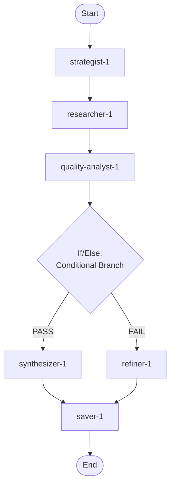

## Workflow Execution Guide

Follow the Mermaid flowchart above to execute the workflow. Each node type has specific execution methods as described below.

### Execution Methods by Node Type

- **Rectangle nodes**: Execute Sub-Agents using the Task tool
- **Diamond nodes (AskUserQuestion:...)**: Use the AskUserQuestion tool to prompt the user and branch based on their response
- **Diamond nodes (Branch/Switch:...)**: Automatically branch based on the results of previous processing (see details section)
- **Rectangle nodes (Prompt nodes)**: Execute the prompts described in the details section below

### If/Else Node Details

#### quality_gate_1(Binary Branch (True/False))

**Evaluation Target**: Quality Report verdict from the Quality Analyst output

**Branch conditions:**
- **PASS**: Quality report verdict is PASS - over 70% of findings meet quality threshold and confidence is medium or high
- **FAIL**: Quality report verdict is FAIL - too many low-quality findings, major coverage gaps, or low confidence

**Execution method**: Evaluate the results of the previous processing and automatically select the appropriate branch based on the conditions above.
