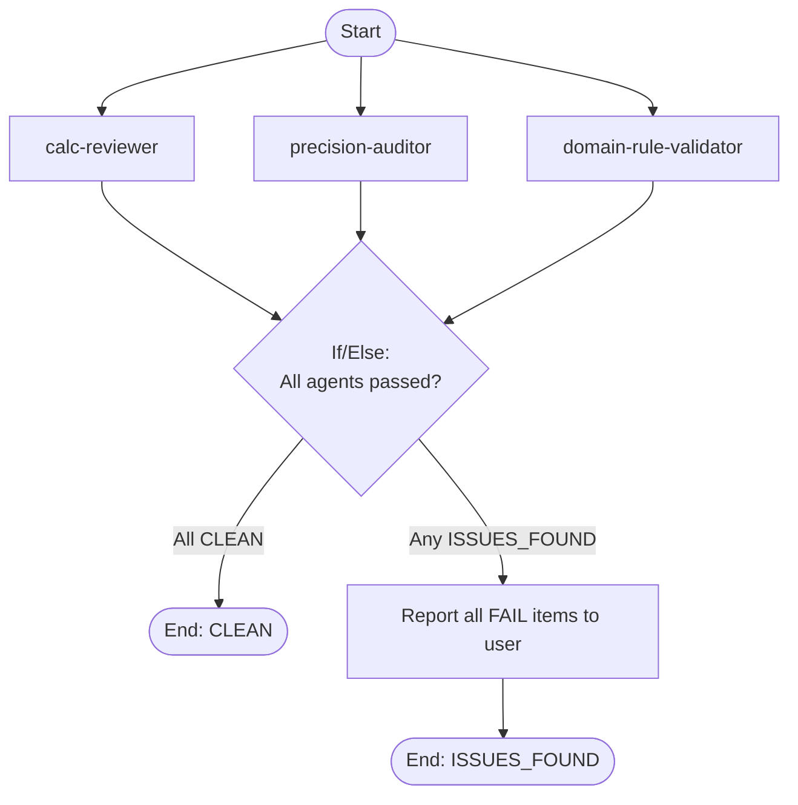

## Workflow Execution Guide

Follow the Mermaid flowchart above to execute the workflow. Each node type has specific execution methods as described below.

### Execution Methods by Node Type

- **Rectangle nodes**: Execute Sub-Agents using the Task tool. All three agents run in PARALLEL (they are read-only, no conflicts).
- **Diamond nodes (If/Else:...)**: Automatically branch based on the results of previous processing.

### If/Else Node Details

#### aggregate (Binary Branch)

**Evaluation Target**: Combined output from all three agents.

**Branch conditions:**

- **All CLEAN**: Every agent's SUMMARY shows CLEAN with 0 violations
- **Any ISSUES_FOUND**: At least one agent's SUMMARY shows ISSUES_FOUND

**Execution method**: Merge all three agent reports. If ANY agent reported ISSUES_FOUND, take the ISSUES_FOUND branch. Consolidate all FAIL items into a single report for the user.
