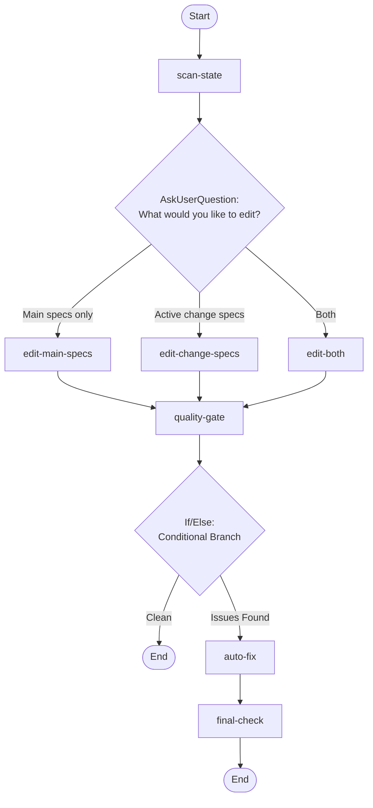

## Workflow Execution Guide

Follow the Mermaid flowchart above to execute the workflow. Each node type has specific execution methods as described below.

### Execution Methods by Node Type

- **Rectangle nodes**: Execute Sub-Agents using the Task tool
- **Diamond nodes (AskUserQuestion:...)**: Use the AskUserQuestion tool to prompt the user and branch based on their response
- **Diamond nodes (Branch/Switch:...)**: Automatically branch based on the results of previous processing (see details section)
- **Rectangle nodes (Prompt nodes)**: Execute the prompts described in the details section below

### AskUserQuestion Node Details

Ask the user and proceed based on their choice.

#### ask_edit_scope(What would you like to edit?)

**Selection mode:** Single Select (branches based on the selected option)

**Options:**
- **Main specs only**: Edit the main specs in openspec/specs/ (the source of truth)
- **Active change specs**: Edit artifacts in the current active change (delta specs, design, etc.)
- **Both**: Edit both main specs and active change artifacts together

### If/Else Node Details

#### check_quality(Binary Branch (True/False))

**Branch conditions:**
- **Clean**: Quality gate report shows CLEAN verdict with no FAIL items
- **Issues Found**: Quality gate report shows ISSUES_FOUND with one or more FAIL items

**Execution method**: Evaluate the results of the previous processing and automatically select the appropriate branch based on the conditions above.
