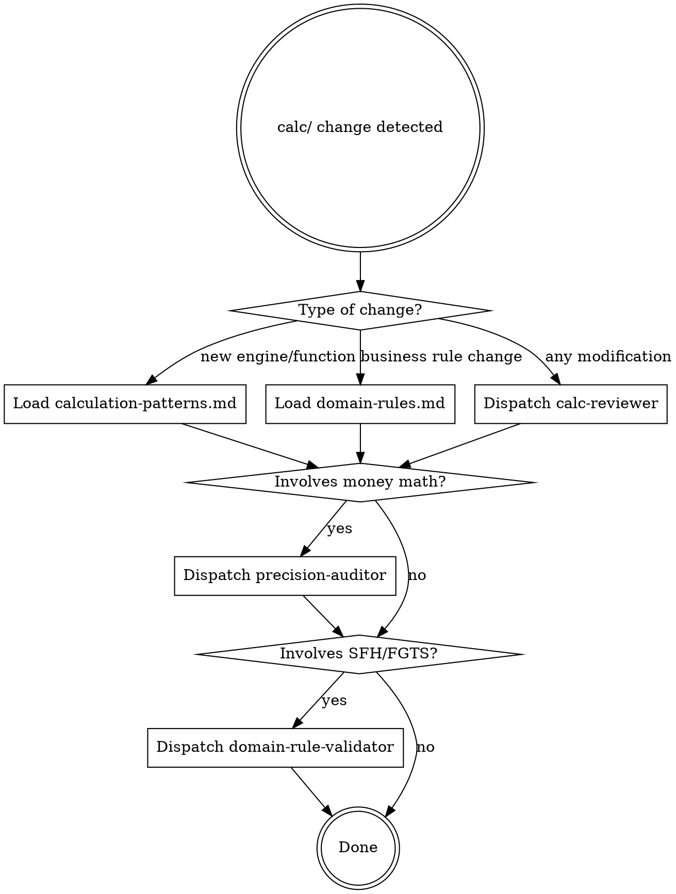

# Backend Domain

The calculation engine at `src/lib/calc/` implements Brazilian real estate financing math — SAC and Price amortization, schedule building, comparison analysis, input validation, and financial formatting. This skill enforces correctness, precision, and regulatory compliance for all changes to this layer.

**Scope boundary:** `src/lib/calc/` only. Stores, components, and routes are out of scope.

## Guardrails (Always Apply)

| Rule | Detail |
| --- | --- |
| `round2()` for all money | Every monetary arithmetic result wrapped in `round2()` from `format.ts`. Never raw `Math.round`, `Math.floor`, `Math.ceil`, or `.toFixed()`. |
| Pure functions only | No side effects, no DOM access, no store imports, no `console.log`. Input in, result out. |
| Never mutate inputs | Schedule arrays, Period objects, and ValidatedInputs are immutable. Create new objects. |
| Validate before compute | All paths to `buildSchedule()` go through `validate()` first. |
| Balance convergence | Every schedule's final period must have `balance === 0`. |
| Engine interface | Every engine exports `(PV: number, n: number, i: number, tr?: number) => Period[]`. |
| Exact test assertions | Use `toBe()` with exact values for monetary assertions. Never `toBeCloseTo()`. |
| `round2()` in tests too | Use `round2()` for expected values in tests, not raw `Math.round`. |
| Manual cross-verification | Every engine test must verify against a hand-calculated reference value, not just formula recomputation. |
| Downstream impact check | Type changes (e.g., widening `Schedule.system` union) require checking all consumers: stores, components, comparison logic. |

## Router



## Agent Dispatch

All companion agents produce the same output:

```
- PASS: what passed (bullet list)
- FAIL: file:line + violation description
- SUMMARY: CLEAN or ISSUES_FOUND with count
```

**calc-reviewer** — Dispatch via Task tool (subagent_type: `calc-reviewer`). Pass: list of changed files. Reviews: pure function pattern, engine interface, immutability, test coverage, imports.

**precision-auditor** — Dispatch via Task tool (subagent_type: `precision-auditor`). Pass: list of changed files. Reviews: `round2()` usage, raw Math ops, test assertion precision, balance convergence. Also runs `scripts/precision-check.sh`.

**domain-rule-validator** — Dispatch via Task tool (subagent_type: `domain-rule-validator`). Pass: list of changed files. Reviews: SFH ceilings, FGTS restrictions, hardcoded limits, pt-BR messages, formula correctness.

## Full Pipeline

For comprehensive review, use `/my:backend-quality-pipeline` — runs all three agents in parallel and aggregates results.

## Red Flags — STOP and Reconsider

- Using `toBeCloseTo()` for monetary values
- Using `Math.round()` instead of `round2()`
- Skipping tests because "it's simple"
- Modifying types.ts without checking downstream consumers
- Copying financial formulas without manual verification
- "Make it fast" pressure overriding quality checks
- Adding `console.log` for debugging and leaving it in
- Importing from stores or components into calc/

**All of these mean: pause, review, and correct before proceeding.**
