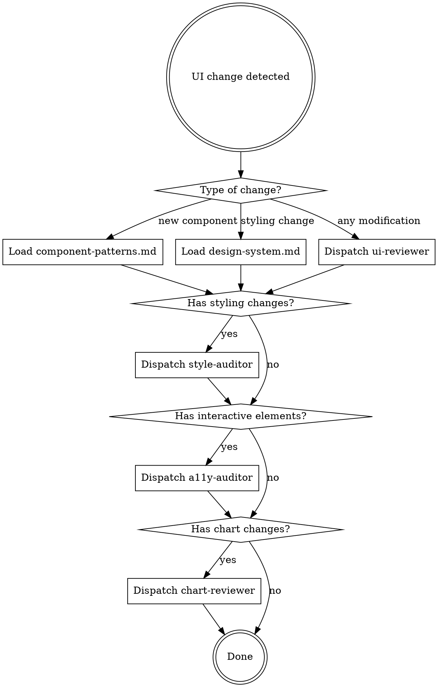

# Frontend Domain

The UI layer at `src/lib/components/`, `src/lib/stores/`, and `src/routes/` implements the Brazilian real estate financing simulator interface — Svelte 5 components with shadcn-svelte primitives, TailwindCSS v4, custom SVG charts, and a rune-based store. This skill enforces consistency, accessibility, and design system compliance for all changes to this layer.

**Scope boundary:** `src/lib/components/`, `src/lib/stores/`, `src/routes/`, `src/app.css`. The calculation engine at `src/lib/calc/` is out of scope — see `backend-domain` skill.

## Guardrails (Always Apply)

| Rule | Detail |
| --- | --- |
| Svelte 5 only | No `$:`, `export let`, `on:click`, `<slot>`, `createEventDispatcher`. Use `$state`, `$derived`, `$props()`, `onclick`, `{@render}`, callback props. |
| shadcn-first | Interactive elements use shadcn/bits-ui primitives. No raw `<button>`, `<input>`, `<select>`, `<label>` outside chart SVGs. |
| Store via getter | Access state through `getSimulationState()`. Never import raw `$state` variables. Call once at component top level. |
| No calc logic in UI | Components call `formatBRL()` / `formatPercent()` for display. All math lives in `src/lib/calc/`. |
| Dark mode always | Every `bg-*` paired with `dark:bg-*`. Every `border-zinc-200` paired with `dark:border-zinc-800`. |
| Portuguese UI | All user-facing text in pt-BR. Comments and code stay in English. |
| `formatBRL()` for money | Never use raw `.toLocaleString()` or template literals for currency display. Import from `$lib/calc/format`. |
| Snippet children | shadcn components receive content via `{#snippet children()}...{/snippet}`. |
| Conditional guards | Use `{#if}` blocks to guard nullable derived state. Minimize non-null assertions (`!`). |
| Responsive grid | `grid-cols-1 md:grid-cols-2 gap-4` for two-column layouts. Single `md:` breakpoint strategy. |

## Router



## Agent Dispatch

All companion agents produce the same output:

```text
- PASS: what passed (bullet list)
- FAIL: file:line + violation description
- SUMMARY: CLEAN or ISSUES_FOUND with count
```

**ui-reviewer** — Dispatch via Task tool (subagent_type: `ui-reviewer`). Pass: list of changed files. Reviews: Svelte 5 compliance, shadcn-first rule, store access pattern, import conventions, snippet usage, conditional guards, formatting function usage.

**style-auditor** — Dispatch via Task tool (subagent_type: `style-auditor`). Pass: list of changed files. Reviews: dark mode pairing, color palette compliance, spacing scale, responsive breakpoints, border/radius conventions, section pattern. Also runs `scripts/style-check.sh`.

**a11y-auditor** — Dispatch via Task tool (subagent_type: `a11y-auditor`). Pass: list of changed files. Reviews: form labels, ARIA attributes, keyboard navigation, semantic HTML, focus management, pt-BR language compliance.

**chart-reviewer** — Dispatch via Task tool (subagent_type: `chart-reviewer`). Pass: list of changed files. Reviews: SVG chart dimensions, color mapping, downsampling logic, path helper usage, axis labeling, legend placement, dark mode backgrounds, `formatBRL()` on Y-axis labels.

## Full Pipeline

For comprehensive review, use `/my:frontend-quality-pipeline` — runs all four agents in parallel and aggregates results.

## Red Flags — STOP and Reconsider

- Using `$:` reactive declarations (Svelte 4 syntax)
- Using `export let` for component props
- Using `on:click` instead of `onclick`
- Using raw `<button>` or `<input>` instead of shadcn components
- Missing `dark:` counterpart on background or border classes
- Using `.toLocaleString()` instead of `formatBRL()`
- English text appearing in the UI
- Importing calc engine functions directly into components (bypass store)
- Using `$effect` to synchronize derived state (use `$derived` instead)
- Adding inline styles when Tailwind classes exist
- Creating SVG charts without downsampling for large datasets

**All of these mean: pause, review, and correct before proceeding.**

## Additional Resources

### Reference Files

For detailed patterns and conventions, consult:

- **`references/component-patterns.md`** — Svelte 5 rune patterns, store access, shadcn-svelte imports, component composition, virtual scrolling, currency display rules
- **`references/design-system.md`** — Color palette, typography, spacing, dark mode checklist, SVG chart conventions, responsive breakpoints, pt-BR language rules
- **`references/quality-gates.md`** — All 8 quality gate definitions with specific checks per gate

### Scripts

- **`scripts/style-check.sh`** — Grep-based automated check for missing dark mode pairs, Svelte 4 patterns, raw HTML interactive elements
