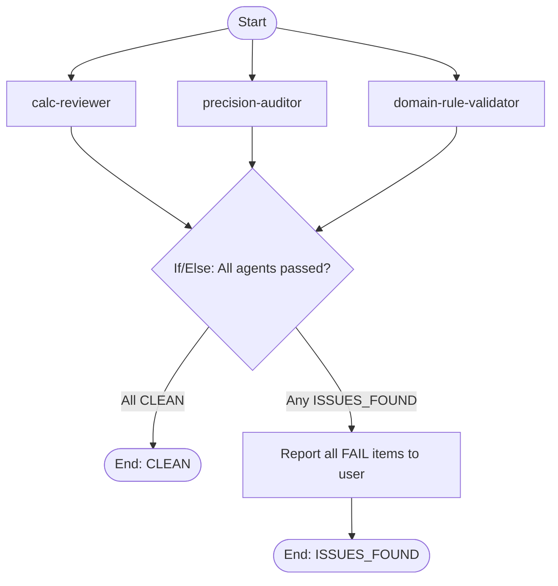

# Backend Domain Skill Design

**Date:** 2026-02-15
**Status:** Approved
**Scope:** `src/lib/calc/` — pure TypeScript calculation engine layer

## Problem

The financing simulator's calculation engine needs comprehensive guardrails for:
- Financial math correctness (precision, rounding)
- Brazilian SFH regulation compliance (FGTS, property ceilings, income caps)
- Architectural pattern enforcement (pure functions, engine interface, immutability)
- Quality gates before any calc/ change ships

No single mechanism covers all three. The skill unifies them as a pipeline-integrated router with specialized sub-agents.

## Architecture: Layered Skill with Progressive Disclosure

### Approach

A focused SKILL.md (~300 words) acts as a **router**. It identifies the type of calc/ work, loads specific references on demand, and dispatches appropriate agents. Token-efficient: only the router loads on trigger, references load contextually.

### Directory Structure (8 files)

```
.claude/skills/backend-domain/
├── SKILL.md                              # Router: triggers, flowchart, dispatch logic
├── references/
│   ├── domain-rules.md                   # SFH regulations, FGTS rules, business invariants
│   ├── calculation-patterns.md           # Pure function patterns, engine structure, round2()
│   └── quality-gates.md                  # Test requirements, precision checks, consistency rules
└── scripts/
    └── precision-check.sh                # Automated: scans for raw Math ops without round2()

.claude/agents/
├── calc-reviewer.md                      # Reviews calc/ changes for pattern compliance
├── precision-auditor.md                  # Verifies financial math precision and rounding
└── domain-rule-validator.md              # Checks SFH/FGTS business rule compliance

.claude/commands/my/
└── backend-quality-pipeline.md           # Full pipeline: parallel agents + aggregate gate
```

## SKILL.md — Router Design

**Trigger:** Any creation, modification, or review of files in `src/lib/calc/`.

**Frontmatter:**
```yaml
---
name: backend-domain
description: Use when creating, modifying, or reviewing files in src/lib/calc/ — the calculation engine layer. Covers Brazilian financing domain rules (SFH, FGTS), financial math precision, pure function patterns, and quality gates for the calculation pipeline.
---
```

**Body contains:**
1. Overview (~3 sentences): scope boundary, what the engine is
2. Decision flowchart: routes by change type (new engine, business rule, any modification)
3. Agent dispatch instructions: what context to pass to each agent
4. Guardrail summary table: hard rules that always apply

## References

### domain-rules.md

| Section | Contents |
|---------|----------|
| SFH Ceilings | Max property R$ 2.250.000, max rate 12% a.a., max term 420 months, min down payment 20% |
| FGTS Restrictions | Max property R$ 1.500.000, 24-month interval, first-property rule |
| Income Commitment | 30% gross monthly income cap |
| Amortization Invariants | SAC: decreasing installments. Price: constant installments. Both: balance reaches zero. |
| Validation Contract | `{ ok: true, data } \| { ok: false, errors[] }` |
| Currency Rules | BRL, dot thousands, comma decimals, a.a./a.m. suffixes |

### calculation-patterns.md

| Section | Contents |
|---------|----------|
| Pure Function Rule | No side effects, no DOM, no store access |
| Precision Strategy | `round2()` wraps every monetary calculation |
| Engine Interface | `(inputs: ValidatedInputs) => SchedulePeriod[]` |
| Schedule Builder | `buildSchedule(system, inputs)` delegates to engine |
| Comparison Contract | `compareSchedules(a, b)` returns deltas |
| Extra Amortization | Modifies copy, never mutates original |
| Test Helpers | `validInputs()`, `makeInputs(overrides)`, cross-verified against manual calculations |

### quality-gates.md

| Gate | Rule | Verification |
|------|------|-------------|
| Tests pass | All vitest green | `npm test` |
| Precision audit | No raw Math.round/toFixed without round2() | precision-auditor + script |
| Domain compliance | Business rules match SFH regulations | domain-rule-validator |
| Pattern compliance | Follows engine/builder/comparison patterns | calc-reviewer |
| Type safety | svelte-check zero errors | `npm run check` |
| Balance convergence | Final outstanding balance === 0 | Test assertion |
| Cross-engine consistency | SAC and Price produce same financed amount | Test assertion |

## Companion Agents

All three agents share the same output contract:
```
- PASS: what passed (bullet list)
- FAIL: file:line + violation description
- SUMMARY: CLEAN or ISSUES_FOUND with count
```

### calc-reviewer

- **Model:** sonnet
- **Tools:** Read, Glob, Grep
- **Skills:** backend-domain
- **Focus:** Pure function pattern, engine interface conformance, immutability, missing test coverage

### precision-auditor

- **Model:** sonnet
- **Tools:** Read, Grep, Bash
- **Skills:** backend-domain
- **Focus:** Raw Math ops, round2() wrapping, exact test assertions, balance convergence

### domain-rule-validator

- **Model:** sonnet
- **Tools:** Read, Grep, Glob
- **Skills:** backend-domain
- **Focus:** SFH ceiling enforcement, FGTS restrictions, hardcoded limits, missing validations

## Pipeline: backend-quality-pipeline

Follows existing Mermaid flowchart pattern (same as deep-research-pipeline, openspec-edit-pipeline).



**Design choices:**
- Parallel dispatch (all agents read-only)
- Aggregate gate merges reports into single verdict
- No auto-fix (financial math requires human judgment)
- Two invocation paths: manual (`/my:backend-quality-pipeline`) and automatic (SKILL.md router)

## Decisions

1. **Calc-only scope** — Stores and components excluded. The skill covers `src/lib/calc/` boundary only.
2. **No auto-fix** — Unlike the openspec edit pipeline, calc fixes require human judgment.
3. **Skill + linked agents** — Standard-compliant: agents in `.claude/agents/` declare `skills: [backend-domain]`.
4. **Progressive disclosure** — SKILL.md is a small router; references load on demand.
5. **Pipeline-integrated** — Auto-invoked on calc/ changes AND available as manual pipeline command.
