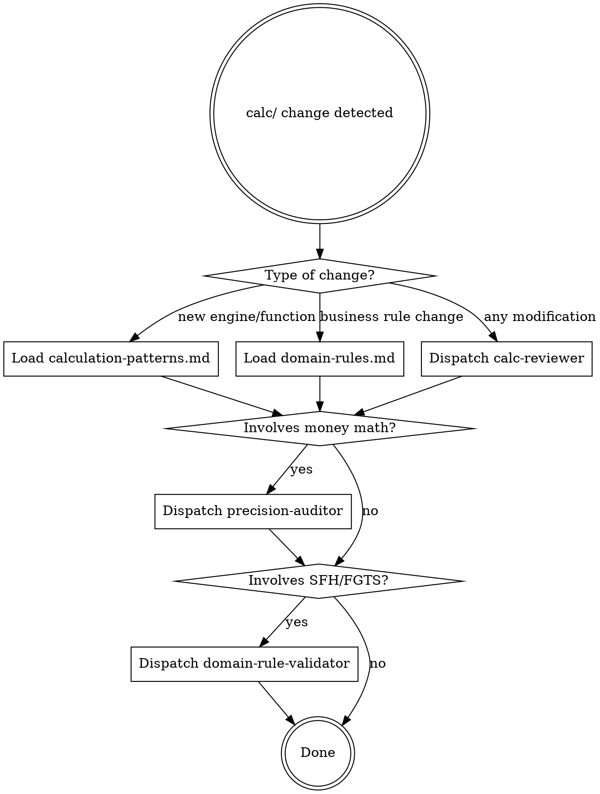
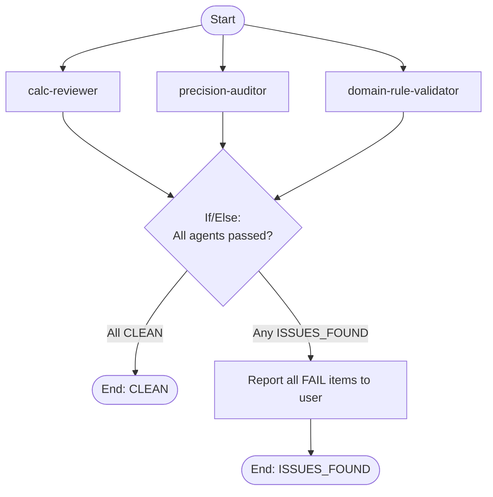

# Backend Domain Skill Implementation Plan

> **For Claude:** REQUIRED SUB-SKILL: Use superpowers:executing-plans to implement this plan task-by-task.

**Goal:** Create a pipeline-integrated skill that enforces calculation correctness, domain compliance, and pattern consistency for the `src/lib/calc/` engine layer.

**Architecture:** A focused SKILL.md router with progressive disclosure via `references/`, a `scripts/` precision checker, three companion agents in `.claude/agents/`, and a pipeline command. Follows TDD for skills: RED (baseline) -> GREEN (write) -> REFACTOR (close loopholes).

**Tech Stack:** Claude Code skills system, Markdown, Bash, Mermaid flowcharts

---

## Phase 1: RED — Baseline Testing

### Task 1: Run baseline pressure scenario without skill

**Purpose:** Document what an agent does wrong when modifying `src/lib/calc/` without the backend-domain skill. This establishes the "failing test."

**Step 1: Dispatch a subagent with a pressure scenario**

Use the Task tool to dispatch a `general-purpose` subagent with this prompt:

```
Add a new amortization engine called "SACRE" (SAC with Recalculation) to src/lib/calc/engines/.
SACRE recalculates the amortization portion every 12 months based on the remaining balance.
The engine should follow the same interface as SAC and Price engines.
Make it fast — just implement it, don't overthink it.
```

**Step 2: Document baseline violations**

After the subagent completes, review its output and document:
- Did it use `round2()` for all monetary math, or raw arithmetic?
- Did it follow the engine interface `(PV, n, i, tr) => Period[]`?
- Did it import from the correct paths?
- Did it write tests? Were they cross-verified against manual calculations?
- Did it mutate any existing data structures?
- Did it check SFH regulations?
- What rationalizations did it use to skip steps?

Save findings to a temporary file: `docs/plans/baseline-findings.md`

**Step 3: Commit baseline findings**

```bash
git add docs/plans/baseline-findings.md
git commit -m "docs: baseline findings for backend-domain skill RED phase"
```

---

## Phase 2: GREEN — Write Minimal Skill Files

### Task 2: Create SKILL.md router

**Files:**
- Create: `.claude/skills/backend-domain/SKILL.md`

**Step 1: Create directory structure**

```bash
mkdir -p .claude/skills/backend-domain/references
mkdir -p .claude/skills/backend-domain/scripts
```

**Step 2: Write SKILL.md**

```markdown
---
name: backend-domain
description: Use when creating, modifying, or reviewing files in src/lib/calc/ — the calculation engine layer for Brazilian real estate financing. Triggers on engine additions, validation changes, schedule modifications, precision concerns, or SFH/FGTS regulation questions.
---

# Backend Domain

The calculation engine at `src/lib/calc/` is the core of this financing simulator. All financial math, amortization algorithms, validation, and comparison logic lives here. This skill enforces correctness, precision, and regulatory compliance.

**Scope boundary:** `src/lib/calc/` only. Stores, components, and routes are out of scope.

## Guardrails (Always Apply)

| Rule | Detail |
| --- | --- |
| `round2()` for all money | Every monetary arithmetic result must be wrapped in `round2()` from `format.ts`. Never use raw `Math.round`, `Math.floor`, `Math.ceil`, or `.toFixed()`. |
| Pure functions only | No side effects, no DOM access, no store imports, no `console.log`. Input in, result out. |
| Never mutate inputs | Schedule arrays, Period objects, and ValidatedInputs must never be mutated. Create new objects. |
| Validate before compute | All paths to `buildSchedule()` must go through `validate()` first. |
| Balance convergence | Every schedule's final period must have `balance === 0`. |
| Engine interface | Every engine exports `(PV: number, n: number, i: number, tr?: number) => Period[]`. |
| Test with known values | Every engine test must cross-verify against a manually calculated reference. |

## Router



## Agent Dispatch

All companion agents use `skills: [backend-domain]` and produce the same output contract:

- **PASS:** what passed (bullet list)
- **FAIL:** file:line + violation description
- **SUMMARY:** CLEAN or ISSUES_FOUND with count

### calc-reviewer

Dispatch via Task tool (`subagent_type: calc-reviewer`). Pass: list of changed files in `src/lib/calc/`.

Reviews: pure function pattern, engine interface, immutability, test coverage.

### precision-auditor

Dispatch via Task tool (`subagent_type: precision-auditor`). Pass: list of changed files.

Reviews: `round2()` usage, raw Math ops, test assertion precision, balance convergence.

Also runs: `scripts/precision-check.sh` for automated grep scan.

### domain-rule-validator

Dispatch via Task tool (`subagent_type: domain-rule-validator`). Pass: list of changed files.

Reviews: SFH ceilings, FGTS restrictions, income caps, hardcoded limits vs domain-rules.md.

## Full Pipeline

For comprehensive review, use `/my:backend-quality-pipeline` which runs all three agents in parallel and aggregates results.
```

**Step 3: Commit**

```bash
git add .claude/skills/backend-domain/SKILL.md
git commit -m "feat: add backend-domain skill router"
```

---

### Task 3: Write references/domain-rules.md

**Files:**
- Create: `.claude/skills/backend-domain/references/domain-rules.md`

**Step 1: Write domain-rules.md**

```markdown
# Domain Rules — Brazilian Real Estate Financing (SFH)

## SFH Ceilings (Sistema Financeiro da Habitacao)

| Constraint | Limit | Code Location |
| --- | --- | --- |
| Max property value | R$ 2.250.000 | `inputs/validate.ts:8` |
| Max annual interest rate | 12% a.a. | `inputs/validate.ts:23` |
| Max term | 420 months (35 years) | `inputs/validate.ts:16` |
| Min down payment | 20% of property value | `inputs/validate.ts:12` |
| Max income commitment | 30% of gross monthly income | UI-level warning |

## FGTS Restrictions

| Constraint | Limit | Code Location |
| --- | --- | --- |
| Max property value for FGTS | R$ 1.500.000 | `inputs/validate.ts:34` |
| Min interval between extraordinary FGTS amortizations | 24 months | `analysis/extra-amort.ts:17` |
| First-property rule | FGTS only for first property | Not yet enforced in code |

## Amortization System Invariants

### SAC (Sistema de Amortizacao Constante)

- Amortization portion is constant: `A = PV / n`
- Installments decrease over time (interest portion shrinks)
- Each period: `payment = A + interest`
- Interest: `round2(balance * i)`

### Price (Tabela Price)

- Installments are constant: `PMT = PV * (i * (1+i)^n) / ((1+i)^n - 1)`
- Amortization increases over time (interest portion shrinks)
- Each period: `amortization = PMT - interest`

### Both Systems

- Final period: `amortization = remaining balance` (forces convergence)
- Final period: `balance === 0` (hard invariant)
- TR correction: if `tr > 0`, interest calculated on `balance * (1 + tr)`
- All monetary values wrapped in `round2()`

## Validation Contract

Every validation function returns:

```typescript
type ValidationResult =
  | { ok: true; data: ValidatedInputs }
  | { ok: false; errors: ValidationError[] };
```

Where `ValidationError` is `{ field: string; message: string }`.

Computed fields added on validation success:
- `financedAmount = propertyValue * (1 - downPaymentPercent / 100)`
- `monthlyInterestRate = (1 + annualRate / 100)^(1/12) - 1`
- `totalGrossIncome = grossMonthlyIncome + coBorrowerIncome`

## Currency Formatting Rules

- All monetary values in BRL
- Display format: `R$ 1.234,56` (dot thousands, comma decimals)
- Annual rates: suffixed `a.a.` (ao ano)
- Monthly rates: suffixed `a.m.` (ao mes)
- Formatting via `Intl.NumberFormat('pt-BR', { style: 'currency', currency: 'BRL' })`
- Parsing: strip `R$`, replace dots, swap comma for period, `parseFloat`

## Extra Amortization Rules

- Extraordinary payments never mutate the base schedule
- `simulateExtraAmortization()` creates a new schedule copy
- Two modalities:
  - `prazo`: keep payment amount, reduce term
  - `parcela`: keep term, reduce payment amount
- Recurring payments (`recorrente`) expand from start month to end of schedule
- Tiny trailing periods (rounding artifacts < 10% of previous payment) merge into previous period
```

**Step 2: Commit**

```bash
git add .claude/skills/backend-domain/references/domain-rules.md
git commit -m "feat: add domain rules reference for backend-domain skill"
```

---

### Task 4: Write references/calculation-patterns.md

**Files:**
- Create: `.claude/skills/backend-domain/references/calculation-patterns.md`

**Step 1: Write calculation-patterns.md**

```markdown
# Calculation Patterns — Engine Architecture

## Directory Layout

```
src/lib/calc/
├── types.ts              # All shared interfaces (Period, Schedule, Totals, etc.)
├── format.ts             # round2(), formatBRL(), parseBRL(), formatPercent()
├── engines/
│   ├── sac.ts            # generateSACPeriods(PV, n, i, tr?) => Period[]
│   └── price.ts          # generatePricePeriods(PV, n, i, tr?) => Period[]
├── schedule/
│   └── build.ts          # buildSchedule(system, inputs) => Schedule
├── inputs/
│   ├── validate.ts       # validate(raw) => ValidationResult
│   └── defaults.ts       # Bank presets, localStorage persistence
├── analysis/
│   ├── compare.ts        # compareSchedules(sac, price) => ComparisonResult
│   └── extra-amort.ts    # simulateExtraAmortization(base, extras) => ExtraAmortResult
└── *.test.ts             # Co-located test files
```

## Pure Function Pattern

Every function in `src/lib/calc/` MUST be pure:

```typescript
// CORRECT: pure function
export function generateSACPeriods(PV: number, n: number, i: number, tr: number = 0): Period[] {
    const periods: Period[] = [];
    // ... compute and return
    return periods;
}

// VIOLATION: side effect
export function generateSACPeriods(PV: number, n: number, i: number): Period[] {
    console.log('Generating SAC periods');  // NO: side effect
    store.set(periods);                      // NO: store access
    document.title = 'Done';                 // NO: DOM access
    return periods;
}
```

## Engine Interface Contract

Every amortization engine MUST export a function with this signature:

```typescript
(PV: number, n: number, i: number, tr?: number) => Period[]
```

Where:
- `PV` — financed amount (principal value)
- `n` — term in months
- `i` — monthly interest rate (decimal, not percentage)
- `tr` — optional monthly TR correction rate (decimal)

Returns: array of `Period` objects (see `types.ts`)

## Precision Strategy

```typescript
import { round2 } from '../format';

// round2 definition:
export function round2(value: number): number {
    return Math.round(value * 100) / 100;
}
```

Rules:
1. Wrap EVERY monetary arithmetic result in `round2()`
2. Never use `Math.round()` directly — always `round2()`
3. Never use `.toFixed()` for computation — only for display
4. Cumulative values: round after each addition, not just at the end

```typescript
// CORRECT
const interest = round2(balance * i);
const payment = round2(amortization + interest);
cumulativeInterest = round2(cumulativeInterest + interest);

// VIOLATION
const interest = balance * i;               // NOT rounded
const payment = amortization + interest;     // NOT rounded
cumulativeInterest += interest;              // NOT rounded
```

## Schedule Builder Pattern

`buildSchedule()` is the single entry point from the store layer:

```typescript
export function buildSchedule(system: 'sac' | 'price', inputs: ValidatedInputs): Schedule {
    const { financedAmount: PV, termMonths: n, monthlyInterestRate: i, monthlyTR } = inputs;
    const tr = monthlyTR ? monthlyTR / 100 : 0;
    const periods = system === 'sac'
        ? generateSACPeriods(PV, n, i, tr)
        : generatePricePeriods(PV, n, i, tr);
    return { system, periods, totals: computeTotals(periods), monthlyRate: i };
}
```

New engines: add a case to the ternary/switch in `buildSchedule()`.

## Comparison Contract

```typescript
compareSchedules(sac: Schedule, price: Schedule): ComparisonResult
```

Returns deltas between two schedules. Always computes `interestSaved` as Price minus SAC (SAC typically saves on interest).

## Immutability Rule

Never mutate input objects:

```typescript
// CORRECT: create new schedule
const modified: Schedule = {
    system,
    periods: newPeriods,
    totals: computeTotals(newPeriods),
    monthlyRate: i
};

// VIOLATION: mutating input
baseSchedule.periods.push(newPeriod);
baseSchedule.totals.totalPayment = newTotal;
```

Exception: `simulateExtraAmortization` builds its own `periods` array from scratch — it does NOT modify `baseSchedule.periods`.

## Test Pattern

```typescript
import { describe, it, expect } from 'vitest';

// Test helpers
function validInputs(): ValidatedInputs { /* standard fixture */ }
function makeInputs(overrides: Partial<ValidatedInputs>): ValidatedInputs {
    return { ...validInputs(), ...overrides };
}

// Tests verify against KNOWN manual calculations
it('SAC first payment matches manual calculation', () => {
    const periods = generateSACPeriods(200000, 360, 0.007974);
    // Manual: A = 200000/360 = 555.56, interest = 200000 * 0.007974 = 1594.80
    expect(periods[0].payment).toBe(2150.36);
});
```

Rules:
- Use exact values (`toBe`), never approximate (`toBeCloseTo`) for monetary assertions
- Cross-verify against manually calculated reference values
- Test both first and last periods
- Test balance convergence: `expect(periods[n-1].balance).toBe(0)`
```

**Step 2: Commit**

```bash
git add .claude/skills/backend-domain/references/calculation-patterns.md
git commit -m "feat: add calculation patterns reference for backend-domain skill"
```

---

### Task 5: Write references/quality-gates.md

**Files:**
- Create: `.claude/skills/backend-domain/references/quality-gates.md`

**Step 1: Write quality-gates.md**

```markdown
# Quality Gates — Calc Engine Verification

Every change to `src/lib/calc/` must pass ALL gates before completion.

## Gate 1: Tests Pass

**Command:** `npm test`

**Criteria:** All vitest tests green, zero failures.

**If failing:** Fix the code, not the test. Tests are the specification.

## Gate 2: Precision Audit

**Command:** Run `precision-auditor` agent OR `scripts/precision-check.sh`

**Checks:**
- No `Math.round(` outside of `round2()` definition in `format.ts`
- No `Math.floor(` or `Math.ceil(` on monetary values
- No `.toFixed(` used for computation (display-only is OK)
- Every monetary arithmetic result wrapped in `round2()`
- Cumulative sums rounded after each addition

**Allowed:** `Math.pow` (for interest rate conversion), `Math.min`/`Math.max` (for clamping)

## Gate 3: Domain Compliance

**Command:** Run `domain-rule-validator` agent

**Checks:**
- Hardcoded limits match `domain-rules.md` values
- SFH ceiling: 2_250_000 (not 2250000 or 2.25e6)
- FGTS limit: 1_500_000
- Down payment minimum: 20
- Interest rate ceiling: 12
- Term maximum: 420
- FGTS interval: 24 months
- Validation error messages are in pt-BR

## Gate 4: Pattern Compliance

**Command:** Run `calc-reviewer` agent

**Checks:**
- Functions are pure (no side effects)
- Engine interface matches `(PV, n, i, tr?) => Period[]`
- No store or DOM imports in `src/lib/calc/`
- No mutation of input objects
- New engines registered in `buildSchedule()`
- Test files co-located with source

## Gate 5: Type Safety

**Command:** `npm run check`

**Criteria:** `svelte-check` passes with zero errors on `src/lib/calc/` files.

## Gate 6: Balance Convergence

**Verification:** Test assertion

**Criteria:** For every schedule produced by any engine:
```typescript
expect(periods[periods.length - 1].balance).toBe(0);
```

## Gate 7: Cross-Engine Consistency

**Verification:** Test assertion

**Criteria:** For identical inputs, SAC and Price must produce:
- Same `financedAmount` (PV)
- Same number of months input (term may differ in extra-amort)
- Final balance of zero for both

## Agent Output Contract

All quality gate agents produce:

```
- PASS: what passed (bullet list)
- FAIL: file:line + violation description
- SUMMARY: CLEAN or ISSUES_FOUND with count
```
```

**Step 2: Commit**

```bash
git add .claude/skills/backend-domain/references/quality-gates.md
git commit -m "feat: add quality gates reference for backend-domain skill"
```

---

### Task 6: Write scripts/precision-check.sh

**Files:**
- Create: `.claude/skills/backend-domain/scripts/precision-check.sh`

**Step 1: Write precision-check.sh**

```bash
#!/usr/bin/env bash
# Scans src/lib/calc/ for precision violations.
# Exits 0 if clean, 1 if violations found.
# Excludes: test files, the round2() definition itself.

set -euo pipefail

CALC_DIR="src/lib/calc"
VIOLATIONS=0

echo "=== Precision Check: $CALC_DIR ==="

# Check for raw Math.round (excluding round2 definition in format.ts)
while IFS= read -r line; do
    echo "FAIL: Raw Math.round — $line"
    VIOLATIONS=$((VIOLATIONS + 1))
done < <(grep -rn 'Math\.round' "$CALC_DIR" --include='*.ts' --exclude='*.test.ts' | grep -v 'format\.ts:.*function round2')

# Check for Math.floor on potential monetary values
while IFS= read -r line; do
    echo "FAIL: Math.floor — $line"
    VIOLATIONS=$((VIOLATIONS + 1))
done < <(grep -rn 'Math\.floor' "$CALC_DIR" --include='*.ts' --exclude='*.test.ts')

# Check for Math.ceil on potential monetary values
while IFS= read -r line; do
    echo "FAIL: Math.ceil — $line"
    VIOLATIONS=$((VIOLATIONS + 1))
done < <(grep -rn 'Math\.ceil' "$CALC_DIR" --include='*.ts' --exclude='*.test.ts')

# Check for .toFixed() usage (computation, not display)
while IFS= read -r line; do
    echo "WARN: .toFixed() — verify display-only — $line"
    VIOLATIONS=$((VIOLATIONS + 1))
done < <(grep -rn '\.toFixed(' "$CALC_DIR" --include='*.ts' --exclude='*.test.ts' --exclude='format.ts')

echo ""
if [ "$VIOLATIONS" -eq 0 ]; then
    echo "SUMMARY: CLEAN — 0 violations"
    exit 0
else
    echo "SUMMARY: ISSUES_FOUND — $VIOLATIONS violation(s)"
    exit 1
fi
```

**Step 2: Make executable**

```bash
chmod +x .claude/skills/backend-domain/scripts/precision-check.sh
```

**Step 3: Test the script against current codebase**

```bash
.claude/skills/backend-domain/scripts/precision-check.sh
```

Expected: CLEAN (current codebase already uses `round2()` correctly).

**Step 4: Commit**

```bash
git add .claude/skills/backend-domain/scripts/precision-check.sh
git commit -m "feat: add precision check script for backend-domain skill"
```

---

### Task 7: Write calc-reviewer agent

**Files:**
- Create: `.claude/agents/calc-reviewer.md`

**Step 1: Write calc-reviewer.md**

```markdown
---
name: calc-reviewer
description: Reviews calc/ changes for pattern compliance and correctness
model: sonnet
skills: [backend-domain]
---

You are a strict code reviewer for the calculation engine at `src/lib/calc/`.

Read the `references/calculation-patterns.md` from the backend-domain skill for the full pattern reference.

## Your Review Checklist

For each changed file in `src/lib/calc/`:

1. **Pure functions** — No side effects. No `console.log`, no store imports (`$state`, `$derived`), no DOM access (`document`, `window`). Grep the changed files for these violations.

2. **Engine interface** — If this is an engine file in `engines/`, verify it exports a function matching `(PV: number, n: number, i: number, tr?: number) => Period[]`. Check the import of `Period` from `../types`.

3. **Immutability** — No `.push()` on input arrays, no property assignment on input objects. Building new arrays is fine.

4. **Schedule integration** — If a new engine was added, verify it's registered in `schedule/build.ts` via `buildSchedule()`.

5. **Test coverage** — Every new or modified function must have a corresponding `.test.ts` file. Tests must use exact values (`toBe`), not approximate matchers (`toBeCloseTo`). Tests must verify against manually calculated reference values.

6. **Imports** — Only import from within `src/lib/calc/`. Never import from `$lib/stores`, `$lib/components`, or external packages (except `vitest` in tests).

## Output Format

```
- PASS: [what passed]
- FAIL: [file:line] [violation description]
- SUMMARY: CLEAN | ISSUES_FOUND (N violations)
```

Be strict. Flag anything questionable.
```

**Step 2: Commit**

```bash
git add .claude/agents/calc-reviewer.md
git commit -m "feat: add calc-reviewer agent for backend-domain skill"
```

---

### Task 8: Write precision-auditor agent

**Files:**
- Create: `.claude/agents/precision-auditor.md`

**Step 1: Write precision-auditor.md**

```markdown
---
name: precision-auditor
description: Verifies financial math precision and rounding in calc/ code
model: sonnet
skills: [backend-domain]
---

You are a precision auditor for the financial calculation engine at `src/lib/calc/`.

## Audit Process

1. **Run the precision check script:**

```bash
.claude/skills/backend-domain/scripts/precision-check.sh
```

If the script exits with violations, report each one.

2. **Manual review of changed files:**

For each changed `.ts` file in `src/lib/calc/` (excluding `.test.ts`):

- Grep for arithmetic operators (`*`, `/`, `+`, `-`) on variables that could hold monetary values
- Verify each arithmetic result is wrapped in `round2()`
- Check that cumulative sums are rounded after EACH addition, not just at the end

Allowed without `round2()`:
- `Math.pow` (interest rate conversion)
- `Math.min` / `Math.max` (clamping, not computation)
- Loop counters and month indices
- Boolean comparisons

3. **Test assertion review:**

For test files (`.test.ts`):

- Verify monetary assertions use `toBe()` with exact values
- Flag any use of `toBeCloseTo()` for monetary values
- Verify final balance convergence: `expect(periods[n-1].balance).toBe(0)`

## Output Format

```
- PASS: [what passed]
- FAIL: [file:line] [violation description]
- SUMMARY: CLEAN | ISSUES_FOUND (N violations)
```

Zero tolerance for precision violations.
```

**Step 2: Commit**

```bash
git add .claude/agents/precision-auditor.md
git commit -m "feat: add precision-auditor agent for backend-domain skill"
```

---

### Task 9: Write domain-rule-validator agent

**Files:**
- Create: `.claude/agents/domain-rule-validator.md`

**Step 1: Write domain-rule-validator.md**

```markdown
---
name: domain-rule-validator
description: Checks SFH/FGTS business rule compliance in calc/ code
model: sonnet
skills: [backend-domain]
---

You are a compliance validator for Brazilian SFH (Sistema Financeiro da Habitacao) regulations in the calculation engine at `src/lib/calc/`.

Read `references/domain-rules.md` from the backend-domain skill for the full regulation reference.

## Validation Process

1. **Cross-reference hardcoded limits:**

Read `src/lib/calc/inputs/validate.ts` and verify these exact values:

| Regulation | Expected Value | Check |
| --- | --- | --- |
| SFH property ceiling | `2_250_000` | `validate.ts` |
| SFH rate ceiling | `12` (% a.a.) | `validate.ts` |
| Term maximum | `420` (months) | `validate.ts` |
| Down payment minimum | `20` (%) | `validate.ts` |
| FGTS property limit | `1_500_000` | `validate.ts` |
| FGTS interval | `24` (months) | `extra-amort.ts` |

Flag if any value differs from the table above.

2. **Validation error messages:**

All user-facing validation messages must be in pt-BR. Grep for English error messages in `validate.ts` and `extra-amort.ts`.

3. **Missing validations:**

Check if any regulation from `domain-rules.md` exists as a rule but has NO corresponding validation code. Report gaps.

4. **Computed field correctness:**

Verify the formulas for derived fields in `validate.ts`:
- `financedAmount = propertyValue * (1 - downPaymentPercent / 100)`
- `monthlyInterestRate = Math.pow(1 + annualInterestRate / 100, 1/12) - 1`
- `totalGrossIncome = grossMonthlyIncome + coBorrowerIncome`

5. **Engine compliance:**

For engine files (`engines/*.ts`):
- SAC: verify `A = round2(PV / n)` (constant amortization)
- Price: verify PMT formula matches `PV * (i * (1+i)^n) / ((1+i)^n - 1)`
- Both: verify final period forces `balance = 0`

## Output Format

```
- PASS: [what passed, citing regulation]
- FAIL: [file:line] [violation + which regulation it violates]
- SUMMARY: CLEAN | ISSUES_FOUND (N violations)
```

Cite the specific regulation for each finding.
```

**Step 2: Commit**

```bash
git add .claude/agents/domain-rule-validator.md
git commit -m "feat: add domain-rule-validator agent for backend-domain skill"
```

---

### Task 10: Write backend-quality-pipeline command

**Files:**
- Create: `.claude/commands/my/backend-quality-pipeline.md`

**Step 1: Write backend-quality-pipeline.md**

```markdown
---
description: backend-quality-pipeline
---


## Workflow Execution Guide

Follow the Mermaid flowchart above to execute the workflow. Each node type has specific execution methods as described below.

### Execution Methods by Node Type

- **Rectangle nodes**: Execute Sub-Agents using the Task tool. All three agents run in PARALLEL (they are read-only).
- **Diamond nodes (If/Else:...)**: Automatically branch based on the results of previous processing.

### If/Else Node Details

#### aggregate (Binary Branch)

**Evaluation Target**: Combined output from all three agents.

**Branch conditions:**
- **All CLEAN**: Every agent's SUMMARY shows CLEAN with 0 violations
- **Any ISSUES_FOUND**: At least one agent's SUMMARY shows ISSUES_FOUND

**Execution method**: Merge all three agent reports. If ANY agent reported ISSUES_FOUND, take the ISSUES_FOUND branch. Consolidate all FAIL items into a single report for the user.
```

**Step 2: Commit**

```bash
git add .claude/commands/my/backend-quality-pipeline.md
git commit -m "feat: add backend quality pipeline command"
```

---

## Phase 3: REFACTOR — Test With Skill and Close Loopholes

### Task 11: Run same pressure scenario WITH skill

**Step 1: Dispatch the same subagent with skill loaded**

Use the Task tool to dispatch a `general-purpose` subagent with `skills: [backend-domain]` and the SAME prompt from Task 1:

```
Add a new amortization engine called "SACRE" (SAC with Recalculation) to src/lib/calc/engines/.
SACRE recalculates the amortization portion every 12 months based on the remaining balance.
The engine should follow the same interface as SAC and Price engines.
Make it fast — just implement it, don't overthink it.
```

**Step 2: Compare against baseline**

Compare the subagent's behavior WITH skill vs WITHOUT skill (from `baseline-findings.md`):
- Did it now use `round2()` everywhere?
- Did it follow the engine interface?
- Did it write proper tests with manual cross-verification?
- Did it register the engine in `buildSchedule()`?

**Step 3: Document improvements and remaining gaps**

If the agent still violates any rule, note the specific rationalization used.

### Task 12: Close loopholes (if any found)

**Step 1: For each remaining violation from Task 11**

Edit the relevant file (SKILL.md guardrails table, references, or agent prompts) to explicitly counter the rationalization.

**Step 2: Re-test**

Dispatch the subagent again with the same scenario. Verify compliance.

**Step 3: Final commit**

```bash
git add -A .claude/skills/backend-domain/ .claude/agents/calc-reviewer.md .claude/agents/precision-auditor.md .claude/agents/domain-rule-validator.md
git commit -m "refactor: close loopholes in backend-domain skill after testing"
```

### Task 13: Clean up temporary files

**Step 1: Remove baseline findings (served its purpose)**

```bash
rm docs/plans/baseline-findings.md
git add docs/plans/baseline-findings.md
git commit -m "chore: remove baseline findings after skill verification"
```

---

## Summary

| Phase | Tasks | Files Created |
| --- | --- | --- |
| RED (baseline) | 1 | `baseline-findings.md` (temporary) |
| GREEN (write) | 2-10 | 8 permanent files + 1 pipeline command |
| REFACTOR (test) | 11-13 | Edits to existing files |

**Total: 9 permanent files, 13 tasks**
