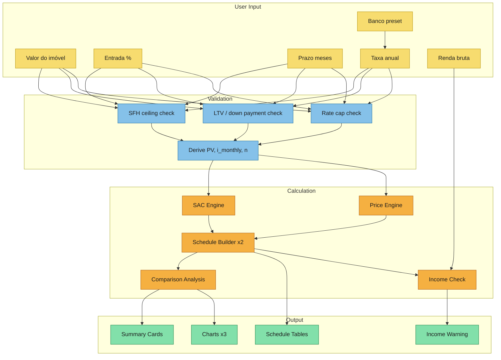
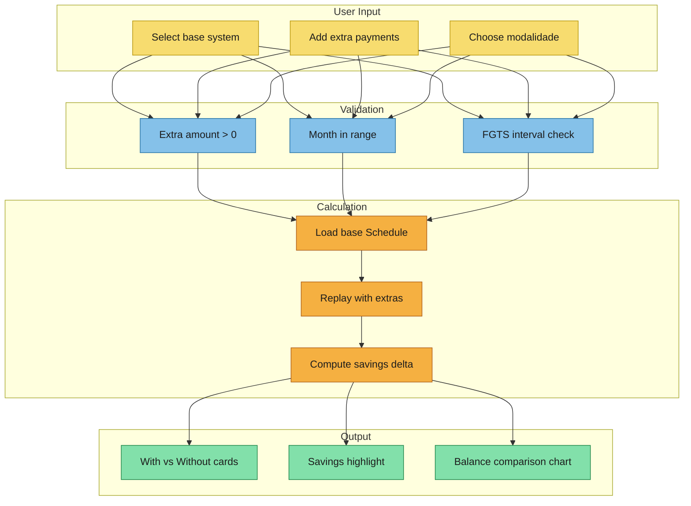

# Calculation Modeling

Convert event-storming outputs into explicit calculation flows.

Three scenarios cover the full application: primary simulation, extraordinary amortization, and bank preset selection.

---

## Scenario 1: Primary Simulation (SAC vs Price)

- Scenario: User enters financing parameters and runs simulation
- Business objective: Compare SAC and Price amortization schedules side-by-side with charts
- Source references from `event-storming.md`: Triggers "Run simulation", Actions "Fill financing parameters" / "Click Simular", Domains "Input Validation" / "SAC Engine" / "Price Engine" / "Schedule Builder" / "Comparison Analysis"

### User Input

| Field | Data Type | Unit | Default | Source |
|-------|-----------|------|---------|--------|
| Valor do imóvel | number | R$ | — | user-entered |
| Entrada | number | % or R$ | 30% | user-entered |
| Prazo | integer | months | 360 | user-entered |
| Taxa de juros anual | number | % a.a. | per bank preset | user-entered or bank preset |
| Banco | enum | — | Caixa | user-selected |
| Renda bruta mensal | number | R$ | — | user-entered |
| Renda líquida mensal | number | R$ | — | user-entered |
| Saldo FGTS | number | R$ | 0 | user-entered |
| Renda co-participante | number | R$ | 0 | user-entered |
| TR mensal estimada | number | % a.m. | 0 | user-entered (optional) |

### Validation

| Rule | Input(s) | Constraint | Error on failure |
|------|----------|------------|------------------|
| SFH property ceiling | Valor do imóvel | ≤ R$ 2,250,000 | "Valor do imóvel excede o teto do SFH (R$ 2.250.000)" |
| Minimum down payment | Entrada | ≥ 20% of property value | "Entrada mínima de 20% do valor do imóvel" |
| Term range | Prazo | 1–420 months | "Prazo deve ser entre 1 e 420 meses" |
| Interest rate cap | Taxa anual | > 0% and ≤ 12% a.a. | "Taxa excede o limite do SFH (12% a.a.)" |
| Positive values | Valor, Renda bruta | > 0 | "Campo obrigatório" |
| FGTS property limit | Valor, FGTS | FGTS > 0 requires Valor ≤ R$ 1,500,000 | "FGTS não disponível para imóveis acima de R$ 1.500.000" |

After validation passes, derive:
- `PV = Valor do imóvel - Entrada` (financed amount)
- `i = (1 + taxa_anual)^(1/12) - 1` (monthly rate, compound conversion)
- `n = Prazo` (months)

### Calculation

**Step 1: Rate Conversion**
- Formula: `i_monthly = (1 + i_annual / 100) ^ (1/12) - 1`
- Input: annual rate (% a.a.)
- Output: monthly rate (decimal)
- Precision: full float64, no rounding until output

**Step 2: SAC Engine**
- Formula chain:
  ```
  A       = PV / n
  J_t     = SD_(t-1) × i
  P_t     = A + J_t
  SD_t    = SD_(t-1) - A
  SD_0    = PV
  ```
- Iterate t = 1 to n
- With optional TR: `SD_(t-1)_corrected = SD_(t-1) × (1 + TR)`; compute J_t from corrected balance
- Precision: round each P_t, J_t, A to 2 decimal places; adjust final period so SD_n = 0.00 exactly

**Step 3: Price Engine**
- Formula chain:
  ```
  PMT     = PV × [i × (1+i)^n] / [(1+i)^n - 1]
  J_t     = SD_(t-1) × i
  A_t     = PMT - J_t
  SD_t    = SD_(t-1) - A_t
  SD_0    = PV
  ```
- Iterate t = 1 to n
- With optional TR: same correction as SAC
- Precision: same rounding strategy as SAC; adjust final period

**Step 4: Schedule Assembly**
- For each engine, build: `Schedule { periods: Period[], totals: Totals }`
- Period: `{ month, payment, amortization, interest, balance, cumulativeInterest, cumulativeAmortization }`
- Totals: `{ totalPayment, totalInterest, totalAmortization, firstPayment, lastPayment }`

**Step 5: Comparison**
- Input: SAC Schedule, Price Schedule
- Output:
  ```
  ComparisonResult {
    sacTotals, priceTotals,
    interestSaved: priceTotals.totalInterest - sacTotals.totalInterest,
    firstPaymentDelta: sacTotals.firstPayment - priceTotals.firstPayment
  }
  ```

**Step 6: Income Commitment Check (post-calculation)**
- `maxPayment = max(SAC P_1, Price PMT)`
- `grossIncome = renda_bruta + renda_co_participante`
- If `maxPayment > grossIncome × 0.30` → show warning (non-blocking)

### Output

| Output | Data Structure | Display Format | Consumer |
|--------|---------------|----------------|----------|
| SAC Schedule | Schedule | Table with virtual scroll | ScheduleTable (SAC tab) |
| Price Schedule | Schedule | Table with virtual scroll | ScheduleTable (Price tab) |
| Comparison Summary | ComparisonResult | Two summary cards + savings delta | SummaryCards |
| Payment Evolution Chart | Period[].payment from both | Line chart (SAC declining, Price flat) | ComparisonCharts |
| Composition Chart | Period[].{interest, amortization} | Stacked area chart per system | ComparisonCharts |
| Balance Chart | Period[].balance from both | Line chart (SAC linear, Price concave) | ComparisonCharts |
| Income Warning | boolean + message | Banner/alert if triggered | InputForm area |

### Mermaid Flow



---

## Scenario 2: Extraordinary Amortization

- Scenario: User simulates extra payments on an existing schedule
- Business objective: Show total interest saved and term/payment reduction with a "with vs without" comparison
- Source references from `event-storming.md`: Trigger "Run extraordinary amortization", Actions "Configure extraordinary amortization", Domain "Extraordinary Amortization"

### User Input

| Field | Data Type | Unit | Default | Source |
|-------|-----------|------|---------|--------|
| Sistema base | enum (SAC, Price) | — | SAC | user-selected |
| Tipo de pagamento | enum (Pontual, Recorrente) | — | Pontual | user-selected |
| Valor extra | number | R$ | — | user-entered |
| Mês do pagamento | integer | month | — | user-entered (Pontual) |
| A partir do mês | integer | month | 1 | user-entered (Recorrente) |
| Modalidade | enum (Redução de prazo, Redução de parcela) | — | Redução de prazo | user-selected |
| Fonte FGTS | boolean | — | false | user-selected |

User can add multiple extra payment entries (dynamic list with add/remove).

### Validation

| Rule | Input(s) | Constraint | Error |
|------|----------|------------|-------|
| Extra > 0 | Valor extra | > 0 | "Valor deve ser maior que zero" |
| Month in range | Mês | 1 ≤ mês ≤ n | "Mês fora do prazo do financiamento" |
| Not exceed balance | Valor extra, SD at month | extra ≤ SD at target month | "Valor excede saldo devedor no mês" |
| FGTS interval | FGTS entries | ≥ 24 months between FGTS entries | "Intervalo mínimo de 24 meses entre usos do FGTS" |

### Calculation

**Replay Algorithm:**
```
Input: baseSchedule (Schedule), extraPayments (ExtraPayment[])

1. Sort extraPayments by month ascending
2. Clone baseSchedule periods
3. For each period t = 1 to n:
   a. Compute J_t = SD_(t-1) × i  (same as base engine)
   b. Compute base A_t (per system rules)
   c. If extra payment at month t:
      - Apply extra to balance: SD_adjusted = SD_(t-1) - extra
      - If modalidade = "Redução de prazo":
           Keep same A_t going forward, schedule ends earlier
           New n_remaining = ceil(SD_adjusted / A) for SAC
           For Price: recompute PMT with remaining balance and solve for n
      - If modalidade = "Redução de parcela":
           Keep same n_remaining, recalculate with lower PV
           SAC: new A = SD_adjusted / n_remaining
           Price: new PMT = SD_adjusted × [i(1+i)^n_rem] / [(1+i)^n_rem - 1]
   d. If recurring extra: apply extra to each period from start month
   e. Continue until SD ≤ 0, adjust final period
4. Build ModifiedSchedule
5. Compute savings:
   - interestSaved = baseTotals.totalInterest - modifiedTotals.totalInterest
   - termReduction = basePeriods.length - modifiedPeriods.length
   - totalSaved = baseTotals.totalPayment - modifiedTotals.totalPayment
```

### Output

| Output | Data Structure | Display Format | Consumer |
|--------|---------------|----------------|----------|
| Base schedule summary | Totals | Card "Sem amortização extra" | ExtraAmortization |
| Modified schedule summary | Totals | Card "Com amortização extra" | ExtraAmortization |
| Savings summary | SavingsSummary | Highlight card (juros economizados, meses a menos) | ExtraAmortization |
| Balance comparison chart | two Period[].balance arrays | Dual-line chart (with/without) | ExtraAmortization |

### Mermaid Flow



---

## Scenario 3: Bank Preset Selection and Management

- Scenario: User selects a bank preset to auto-fill interest rate, or manages (adds/edits/removes) presets
- Business objective: Quick starting point with real bank rates; user-configurable so presets stay current
- Source references from `event-storming.md`: Triggers "Select bank preset" / "Manage bank presets", Actions "Select bank preset" / "Manage bank presets"

### User Input

| Field | Data Type | Default | Source |
|-------|-----------|---------|--------|
| Banco | select from preset list | Caixa | user-selected |
| Preset management | add/edit/remove | — | user action |

### Validation

None for selection — user enters a rate manually or picks from presets.
For preset management: name is required, rate must be > 0.

### Calculation

No formula. Preset lookup from user-configurable list.

Shipped defaults (reference: Feb 2026):

| Bank | Rate (% a.a. + TR) |
|------|-------------------|
| Caixa | 10.49 |
| Banco do Brasil | 12.00 |
| Itaú | 11.60 |
| Santander | 11.79 |
| Pro-Cotista (Caixa) | 9.01 |

User can modify these defaults, add new banks, or remove entries.
Presets are persisted in `localStorage` and restored on page load.
A "Restaurar padrões" (restore defaults) action resets to shipped values.

### Output

| Output | Display Format | Consumer |
|--------|----------------|----------|
| Annual rate | Auto-fills Taxa anual field | InputForm |
| Updated preset list | Dropdown options | InputForm Select |

No simulation is triggered — user must still click "Simular".

---

## Derivation Notes for Downstream Artifacts

- **Specs inputs**: Three scenarios above map directly to user stories. Scenario 1 = core simulation stories (input, validate, compare, view schedule, view charts). Scenario 2 = extraordinary amortization stories. Scenario 3 = bank preset story. Acceptance criteria come from the validation rules and output tables.
- **Design inputs**: The layered pipeline (inputs/ → engines/ → schedule/ → analysis/) maps exactly to the swim lanes. State management needs to hold: raw inputs, validated inputs, SAC/Price schedules, comparison result, extra amort configuration, modified schedule. All derived reactively from inputs via `$derived`.
- **Data schema inputs**: TypeScript interfaces are directly derivable from the input/output tables above. Formulas are specified in the Calculation sections. Validation rules define Zod schemas. The replay algorithm for extraordinary amortization needs careful specification in data-schema.
