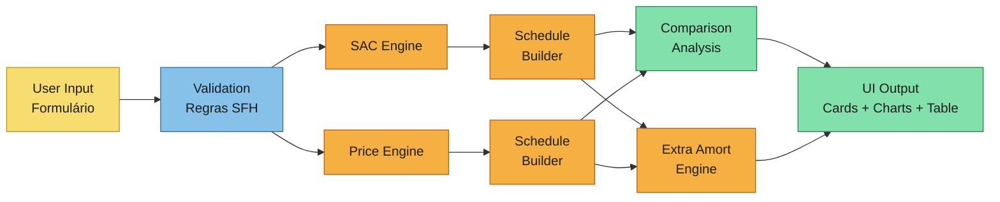

# Event Storming

Capture collaborative discovery outcomes for the Brazilian real estate financing simulator.

## Scope and Goal
- Domain/problem area: Brazilian mortgage simulation — SAC and Price amortization systems
- Desired business outcome: A single-page web app where a user enters financing parameters and instantly compares SAC vs Price schedules, visualizes payment evolution, and simulates extraordinary amortizations
- In scope: SAC engine, Price engine, side-by-side comparison, extraordinary amortization (lump-sum, recurring, FGTS), affordability validation, bank rate presets, charts (payment evolution, composition, balance), virtual-scrolled schedule tables
- Out of scope: SACRE system (removed — mathematically inconsistent), user accounts, backend/API, TR real-time lookup (use hardcoded reference values), IPCA-indexed mortgages, insurance premium calculation (show informational note only), mobile-native app

## Actors
- Primary users: Individual user (personal-use tool) — someone evaluating mortgage options in Brazil
- External data sources: None at runtime. Bank rate presets are shipped as editable defaults (Feb 2026 reference) — user can modify, add, or remove presets via the UI, persisted in localStorage.
- Automated agents: None. All computation is client-side, triggered by explicit user action ("Simular" button).

## Calculation Triggers

- Trigger: **Run simulation**
  - What initiates this calculation: User clicks "Simular" button
  - Input signal: All input fields are populated and pass validation
  - Expected output: Full SAC schedule, full Price schedule, comparison summary, three charts

- Trigger: **Run extraordinary amortization**
  - What initiates this calculation: User configures extra payments and clicks "Simular" in the extraordinary amortization section
  - Input signal: Base schedule already computed + extra payment configuration (type, amount, month, modality)
  - Expected output: "With vs without" comparison — two schedules, savings summary, balance chart overlay

- Trigger: **Select bank preset**
  - What initiates this calculation: User selects a bank from the preset list
  - Input signal: Bank selection change event
  - Expected output: Interest rate field auto-populated with that bank's rate. No recalculation until "Simular" is pressed.

- Trigger: **Manage bank presets**
  - What initiates this: User opens preset management (edit, add, or remove a bank preset)
  - Input signal: User action in preset config UI
  - Expected output: Preset list updated and persisted to localStorage

## User Actions

- Action: **Fill financing parameters**
  - Actor: User
  - Target domain/module: Input form
  - Preconditions: None
  - Expected result: Form fields populated: property value, down payment (% or R$), term (months), annual interest rate, gross income, net income, FGTS balance, co-borrower income

- Action: **Select bank preset**
  - Actor: User
  - Target domain/module: Input form (rate field)
  - Preconditions: At least one preset exists
  - Expected result: Annual interest rate field pre-filled with selected bank's rate

- Action: **Manage bank presets (add/edit/remove)**
  - Actor: User
  - Target domain/module: Preset configuration
  - Preconditions: None
  - Expected result: Preset list updated in localStorage. Shipped defaults: Caixa (10.49%), BB (12.00%), Itaú (11.60%), Santander (11.79%), Pro-Cotista (9.01%). User can modify these or add new entries.

- Action: **Click "Simular"**
  - Actor: User
  - Target domain/module: Validation → SAC engine → Price engine → Schedule builder → Comparison analysis → Charts
  - Preconditions: Required fields filled
  - Expected result: Validation passes → schedules computed → comparison summary rendered → charts rendered → schedule table populated

- Action: **Toggle schedule view (SAC / Price)**
  - Actor: User
  - Target domain/module: Schedule table display
  - Preconditions: Simulation has been run
  - Expected result: Table switches between SAC and Price amortization schedule

- Action: **Configure extraordinary amortization**
  - Actor: User
  - Target domain/module: Extra amortization form
  - Preconditions: Base simulation has been run
  - Expected result: User adds one or more extra payments (pontual or recorrente), selects modality (redução de prazo / redução de parcela), clicks "Simular"

- Action: **Remove an extra payment entry**
  - Actor: User
  - Target domain/module: Extra amortization form
  - Preconditions: At least one extra payment entry exists
  - Expected result: Entry removed from list

## Calculation Domains

- Domain/module: **Input Validation**
  - Responsibilities: Validate all user inputs against range constraints and regulatory rules before any calculation runs
  - Invariants:
    - Property value > 0 and ≤ R$ 2,250,000 (SFH ceiling)
    - Down payment ≥ 20% of property value (LTV max 80%)
    - Term > 0 and ≤ 420 months (35 years)
    - Annual interest rate > 0% and ≤ 12% a.a. (SFH max)
    - Monthly interest rate = (1 + annual)^(1/12) - 1 (compound conversion)
    - First installment ≤ 30% of gross monthly income (including co-borrower if provided)
    - FGTS-eligible property value ≤ R$ 1,500,000
  - Inputs consumed: All form fields
  - Outputs produced: ValidatedInputs object (or validation error messages)

- Domain/module: **SAC Engine**
  - Responsibilities: Compute period-by-period SAC amortization schedule
  - Invariants:
    - Amortization A = PV / n is constant across all periods
    - SD_n = 0 within floating-point tolerance (centavo)
    - Total interest = PV × i × (n + 1) / 2
    - Payments decrease linearly by R = A × i per period
  - Inputs consumed: PV (financed amount), n (term in months), i (monthly rate)
  - Outputs produced: Period[] array (month, payment, amortization, interest, balance)

- Domain/module: **Price Engine**
  - Responsibilities: Compute period-by-period Price/Tabela Price amortization schedule
  - Invariants:
    - PMT is constant across all periods
    - PMT = PV × [i × (1+i)^n] / [(1+i)^n - 1]
    - A_(t+1) / A_t ≈ (1+i) (geometric growth)
    - SD_n = 0 within floating-point tolerance (centavo)
    - Total interest = (PMT × n) - PV
  - Inputs consumed: PV, n, i
  - Outputs produced: Period[] array

- Domain/module: **Schedule Builder**
  - Responsibilities: Assemble full schedule from engine output, handle centavo rounding, adjust final payment if needed
  - Invariants:
    - All monetary values rounded to 2 decimal places (centavos)
    - Final balance exactly 0 (adjust last period if rounding drift)
    - Schedule includes running totals (cumulative interest, cumulative amortization)
  - Inputs consumed: Period[] from engine
  - Outputs produced: Schedule { periods: Period[], totals: Totals }

- Domain/module: **Comparison Analysis**
  - Responsibilities: Compute delta between SAC and Price schedules
  - Invariants: SAC total interest < Price total interest (always, for same inputs)
  - Inputs consumed: SAC Schedule, Price Schedule
  - Outputs produced: ComparisonResult { sacTotals, priceTotals, interestSaved, firstPaymentDelta }

- Domain/module: **Extraordinary Amortization**
  - Responsibilities: Replay a base schedule with injected extra payments, compute savings
  - Invariants:
    - Redução de prazo: payment amount stays same, term shrinks
    - Redução de parcela: term stays same, future payments recalculated on reduced balance
    - Extra payment cannot exceed remaining balance
    - FGTS usage interval: minimum 24 months between uses
  - Inputs consumed: Base Schedule, ExtraPayment[] list
  - Outputs produced: ModifiedSchedule, SavingsSummary { interestSaved, termReduction, totalSaved }

- Domain/module: **Formatting**
  - Responsibilities: Convert numeric values to pt-BR display strings
  - Invariants:
    - Currency: R$ 1.234,56 (dot thousands, comma decimals, 2 places)
    - Percentages: 10,50% a.a. or 0,83% a.m.
    - Months displayed as integers
  - Inputs consumed: Raw numbers
  - Outputs produced: Formatted strings

## Business Rules

- Rule name: **SFH Property Ceiling**
  - Triggering condition: User enters property value
  - Constraint: Property value ≤ R$ 2,250,000
  - Failure/violation handling: Show validation error "Valor do imóvel excede o teto do SFH (R$ 2.250.000)"

- Rule name: **Maximum LTV**
  - Triggering condition: User enters down payment
  - Constraint: Down payment ≥ 20% of property value (financed amount ≤ 80%)
  - Failure/violation handling: Show validation error "Entrada mínima de 20% do valor do imóvel"

- Rule name: **Income Commitment Cap**
  - Triggering condition: After simulation computes first installment
  - Constraint: Max(SAC P_1, Price PMT) ≤ 30% of gross monthly income (borrower + co-borrower)
  - Failure/violation handling: Show warning "Parcela excede 30% da renda bruta mensal" (warning, not blocking — user may still view results)

- Rule name: **SFH Interest Rate Cap**
  - Triggering condition: User enters interest rate
  - Constraint: Annual rate ≤ 12% a.a.
  - Failure/violation handling: Show validation error "Taxa excede o limite do SFH (12% a.a.)"

- Rule name: **FGTS Property Ceiling**
  - Triggering condition: User enters FGTS balance > 0 and property value
  - Constraint: FGTS can only be used if property value ≤ R$ 1,500,000
  - Failure/violation handling: Show warning "FGTS não disponível para imóveis acima de R$ 1.500.000"

- Rule name: **FGTS Amortization Interval**
  - Triggering condition: User configures FGTS extraordinary amortization
  - Constraint: Minimum 24 months between FGTS extra payments
  - Failure/violation handling: Show validation error "Intervalo mínimo de 24 meses entre usos do FGTS"

- Rule name: **No Early Payment Penalty**
  - Triggering condition: Informational — displayed in extraordinary amortization section
  - Constraint: Brazilian law prohibits early payment penalties
  - Failure/violation handling: N/A — display informational note

- Rule name: **Annual-to-Monthly Rate Conversion**
  - Triggering condition: User enters annual rate, system needs monthly rate
  - Constraint: i_monthly = (1 + i_annual)^(1/12) - 1 (compound, not simple division)
  - Failure/violation handling: N/A — internal conversion rule

## Calculation Flow Diagram (Mermaid)

## Hotspots and Open Questions

- Ambiguity: **Insurance display** — MIP and DFI are mandatory in SFH but rates vary by age/property. Show informational estimates only, not computed into the schedule. This avoids false precision.
- Ambiguity: **TR correction** — TR is published daily by BACEN and cannot be predicted. For simulation purposes, offer an optional fixed monthly TR field (default 0%) that the user can set. Do not attempt to fetch live TR values.
- Risk: **Floating-point precision** — Cumulative rounding errors over 360+ periods can cause final balance to drift from zero. Must implement centavo rounding per period and final-period adjustment.
- Risk: **Large schedule rendering** — 360 rows × 5 columns needs virtual scrolling to avoid DOM bloat. Decided: use @tanstack/svelte-virtual.
- Decision needed: None remaining — all key decisions made during exploration.

## Handoff to Next Artifacts

- `calculation-modeling.md`: Use the six calculation domains above as swim lanes. Model the full data flow from input → validation → engines → schedule → analysis → output. Map the extraordinary amortization as a secondary pipeline consuming base schedule output.
- `specs/**/*.md`: Derive user stories from the seven user actions. Each action maps to at least one story. Acceptance criteria should reference the business rules and invariants defined above.
- `design.md`: Architecture should implement the layered pipeline (inputs/ → engines/ → schedule/ → analysis/). Address precision strategy, state management (Svelte 5 runes), shadcn-svelte component mapping, virtual scrolling, and chart integration (LayerChart via shadcn Chart).
- `data-schema.md`: Define TypeScript interfaces for ValidatedInputs, Period, Schedule, Totals, ComparisonResult, ExtraPayment, SavingsSummary. Specify all formulas mathematically and verify against research worked examples.
