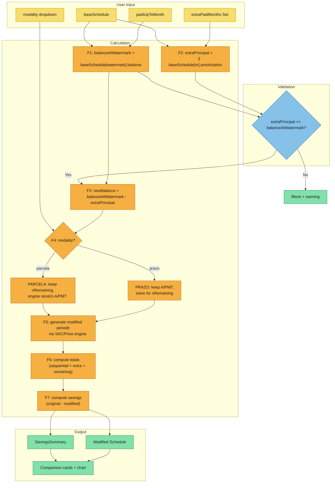
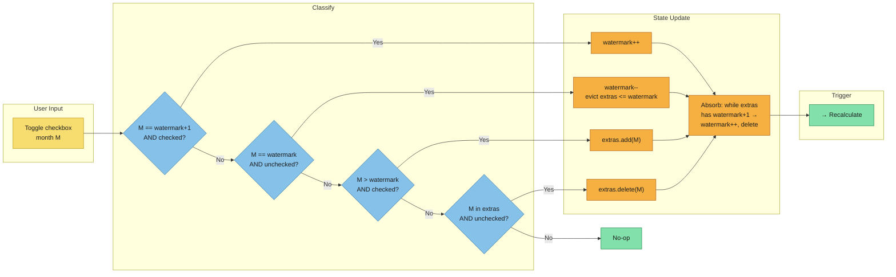

# Calculation Modeling

Convert event-storming outputs into explicit calculation flows for the schedule planning mode.

## Scenario Overview

### Scenario 1: Checkbox Toggle → Recalculation
- Business objective: User marks months as paid (sequential or extra) and sees live impact on their financing plan
- Source references: Event-storming triggers "Checkbox toggled on a schedule row", user actions "Check sequential/extra month", "Uncheck sequential/extra month"

### Scenario 2: Modality Switch → Recalculation
- Business objective: User changes how extra payments affect the schedule (shorten term vs lower payments)
- Source references: Event-storming trigger "Modality dropdown changed", business rules "Prazo modality" and "Parcela modality"

### Scenario 3: Watermark Absorption
- Business objective: Contiguous extra payments automatically merge into the sequential payment block
- Source references: Event-storming business rule "Watermark absorption", domain "Watermark Management"

---

## Swim Lanes

### Scenario 1: Checkbox Toggle → Recalculation

#### User Input
- Input: Month number (integer, 1..N where N = termMonths)
- Input: Action (check or uncheck)
- Data type: `{ month: number, checked: boolean }`
- Source: User clicks checkbox in planning mode

#### Validation

- Rule: Planning mode must be ON
  - Constraint: `planningMode === true`
  - Failure: Checkboxes not rendered; no action possible

- Rule: Sequential uncheck protection
  - Input: month to uncheck, current paidUpToMonth
  - Constraint: If unchecking, month must be `=== paidUpToMonth` (last sequential) OR month must be in `extraPaidMonths`
  - Failure: Checkbox disabled for months `< paidUpToMonth`

- Rule: Balance overflow on check
  - Input: month to check, current extraPaidMonths, baseSchedule
  - Constraint: `currentExtraPrincipal + baseSchedule[month - 1].amortization <= baseSchedule[paidUpToMonth].balance`
  - Note: Only applies when checking a non-sequential month (extras). Sequential months don't trigger this because they consume balance normally.
  - Failure: Check prevented, warning "Saldo insuficiente para mais amortizações extras."

#### Calculation

**Step 1: Classify the toggle**

```
if month === paidUpToMonth + 1 AND checked:
    → sequential extension (increment watermark)
elif month === paidUpToMonth AND NOT checked:
    → sequential shrink (decrement watermark)
elif month > paidUpToMonth AND checked:
    → extra addition (add to extraPaidMonths)
elif month in extraPaidMonths AND NOT checked:
    → extra removal (remove from extraPaidMonths)
```

**Step 2: Update state**

```
Sequential extension:  paidUpToMonth = paidUpToMonth + 1
Sequential shrink:     paidUpToMonth = paidUpToMonth - 1
Extra addition:        extraPaidMonths.add(month)
Extra removal:         extraPaidMonths.delete(month)
```

**Step 3: Watermark absorption** (runs after every state change)

```
while extraPaidMonths.has(paidUpToMonth + 1):
    paidUpToMonth += 1
    extraPaidMonths.delete(paidUpToMonth)

// Also evict any extras that fell below watermark
for m in extraPaidMonths:
    if m <= paidUpToMonth:
        extraPaidMonths.delete(m)
```

**Step 4: Recalculation** (see Scenario 1 core calculation below)

#### Output
- Updated `paidUpToMonth` → checkbox visual state in table
- Updated `extraPaidMonths` → checkbox visual state in table
- Modified `Schedule` → comparison cards
- `SavingsSummary` → savings banner
- Modified balance curve → chart

---

### Scenario 2: Modality Switch

#### User Input
- Input: Selected modality
- Data type: `'prazo' | 'parcela'`
- Default: `'prazo'`
- Source: Dropdown at top of schedule table

#### Validation
- Rule: Planning mode must be ON
  - Constraint: `planningMode === true`
  - Failure: Dropdown not rendered

#### Calculation
- State update: `extraModality = selectedValue`
- Triggers full recalculation with existing paidUpToMonth and extraPaidMonths

#### Output
- Same as Scenario 1 output (modified schedule, savings, chart)

---

## Core Recalculation: `simulatePlanningMode()`

This is the central formula chain, triggered by Scenarios 1 and 2.

### Inputs

| Parameter | Type | Source |
|-----------|------|--------|
| `baseSchedule` | `Schedule` | Original SAC or Price schedule from store |
| `paidUpToMonth` | `number` | Store state (watermark) |
| `extraPaidMonths` | `Set<number>` | Store state (individual extras) |
| `modality` | `'prazo' \| 'parcela'` | Store state (dropdown) |

### Formula Chain

**F1: Extract balance at watermark**

```
if paidUpToMonth === 0:
    balanceAtWatermark = baseSchedule.periods[0].balance
                       + baseSchedule.periods[0].amortization
    // This equals PV (financed amount)
else:
    balanceAtWatermark = baseSchedule.periods[paidUpToMonth - 1].balance
    // Balance after the last sequential payment
```

Precision: Value comes directly from base schedule (already round2'd).

**F2: Compute extra principal**

```
extraPrincipal = round2(
    Σ baseSchedule.periods[m - 1].amortization
    for m in extraPaidMonths
)
```

Invariant: Uses ORIGINAL schedule amortization values.

For SAC: every amortization = round2(PV / n), so `extraPrincipal = count × A`.
For Price: amortization varies per month (increases over time), so each month contributes a different amount.

**F3: Compute new balance**

```
newBalance = round2(balanceAtWatermark - extraPrincipal)
```

Guard: If `newBalance < 0`, cap at 0 (loan fully paid).

**F4: Determine remaining parameters by modality**

```
nOriginalRemaining = baseSchedule.periods.length - paidUpToMonth
i = baseSchedule.monthlyRate
tr = (from original inputs, passed through)

if modality === 'prazo':
    // Keep original A or PMT, let term shorten
    if system === 'sac':
        A_original = baseSchedule.periods[0].amortization
        // SAC: A is constant, engine will figure term from newBalance / A
        nRemaining = ceil(newBalance / A_original)
        → generateSACPeriods(newBalance, nRemaining, i, tr)
    else: // price
        PMT_original = baseSchedule.periods[0].payment
        // Price: PMT constant, solve for n
        // n = -ln(1 - newBalance × i / PMT) / ln(1 + i)
        nRemaining = ceil(-Math.log(1 - newBalance * i / PMT_original) / Math.log(1 + i))
        → generatePricePeriods(newBalance, nRemaining, i, tr)

elif modality === 'parcela':
    // Keep same remaining term, recalculate A or PMT
    nRemaining = nOriginalRemaining
    → generateSACPeriods(newBalance, nRemaining, i, tr)
    // or
    → generatePricePeriods(newBalance, nRemaining, i, tr)
    // Engine internally computes new A = newBalance/nRemaining (SAC)
    // or new PMT = computePMT(newBalance, nRemaining, i) (Price)
```

**F5: Build modified schedule**

```
modifiedPeriods = engine(newBalance, nRemaining, i, tr)

// Renumber months to start after watermark
for each period in modifiedPeriods:
    period.month = paidUpToMonth + period.month
```

**F6: Compute modified totals**

```
modifiedTotals = computeTotals(modifiedPeriods)
// totalPayment also includes the extra principal paid
modifiedTotals.totalPayment = round2(modifiedTotals.totalPayment + extraPrincipal)
// And the sequential payments already made
sequentialPayments = round2(
    Σ baseSchedule.periods[m - 1].payment
    for m in 1..paidUpToMonth
)
modifiedTotals.totalPayment = round2(modifiedTotals.totalPayment + sequentialPayments)
```

**F7: Compute savings**

```
savings = {
    interestSaved: round2(baseSchedule.totals.totalInterest - modifiedTotals.totalInterest),
    termReduction: baseSchedule.periods.length - (paidUpToMonth + modifiedPeriods.length),
    totalSaved: round2(baseSchedule.totals.totalPayment - modifiedTotals.totalPayment)
}
```

Note: `totalInterest` for the modified schedule only counts interest on the remaining periods (after watermark). Interest on sequential months 1..paidUpToMonth is the same as original. So:

```
modifiedTotalInterest = round2(
    sequentialInterest + remainingInterest
)
where:
    sequentialInterest = Σ baseSchedule.periods[m-1].interest for m in 1..paidUpToMonth
    remainingInterest = Σ modifiedPeriods[j].interest for j in 0..modifiedPeriods.length
```

### Output Structure

```
{
    modified: Schedule {
        system: 'sac' | 'price',
        periods: Period[],       // renumbered from watermark+1
        totals: Totals,          // includes sequential + extra + remaining
        monthlyRate: number
    },
    savings: SavingsSummary {
        interestSaved: number,   // always >= 0
        termReduction: number,   // months eliminated (can be 0 for parcela)
        totalSaved: number       // total payment difference
    }
}
```

---

## Mermaid Flow: Core Recalculation



## Swimlane Diagram: Watermark Absorption



## Prazo: Solving for nRemaining (Price system)

The Price system requires solving for the number of periods given a fixed PMT and reduced balance. The formula derivation:

```
PMT = PV × [i(1+i)^n] / [(1+i)^n - 1]

Solving for n:
  PMT × [(1+i)^n - 1] = PV × i × (1+i)^n
  PMT × (1+i)^n - PMT = PV × i × (1+i)^n
  (1+i)^n × (PMT - PV × i) = PMT
  (1+i)^n = PMT / (PMT - PV × i)
  n = ln(PMT / (PMT - PV × i)) / ln(1 + i)

Where:
  PV = newBalance
  PMT = original PMT (baseSchedule.periods[0].payment)
  i = monthlyRate

Guard: PMT - newBalance × i must be > 0, otherwise PMT can't cover interest
       (would mean infinite term — shouldn't happen with valid extra selections)
```

Result: `nRemaining = Math.ceil(n)` — round up to whole months.

## Edge Case: newBalance === 0

If extra payments fully cover the remaining balance:

```
newBalance = 0
→ No remaining periods to generate
→ Modified schedule has 0 remaining periods
→ Term = paidUpToMonth (all remaining months eliminated)
→ totalInterest = sequentialInterest only
→ savings.termReduction = basePeriods.length - paidUpToMonth
```

## Edge Case: Single Remaining Period

If `nRemaining === 1` after prazo calculation:

```
→ One final period: payment = newBalance + interest on newBalance
→ Standard engine handles this (isLast logic in both SAC and Price engines)
```

## Derivation Notes for Downstream Artifacts

- **Specs inputs**: Two capabilities to spec — (1) planning-mode-interaction: toggle, checkbox rules, watermark absorption, visual states; (2) planning-recalculation: engine function, modality handling, edge cases, savings computation.
- **Design inputs**: The recalculation reuses existing `generateSACPeriods` / `generatePricePeriods` engines with different parameters. New function `simulatePlanningMode()` orchestrates F1–F7. Store replaces `extraPayments` / `hasSimulatedExtra` with `planningMode` / `paidUpToMonth` / `extraPaidMonths` / `extraModality`. Comparison display migrates from ExtraAmortization into ScheduleTable's planning mode section.
- **Data schema inputs**: New types needed for planning state. Existing `Schedule`, `SavingsSummary`, `Period`, `Totals` types are reused unchanged. New engine function signature: `simulatePlanningMode(baseSchedule, paidUpToMonth, extraPaidMonths, modality) → { modified: Schedule, savings: SavingsSummary }`.
