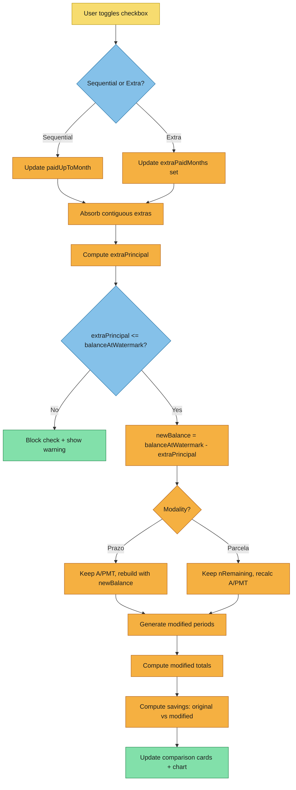

# Event Storming

Capture collaborative discovery outcomes for the schedule planning mode change.

## Scope and Goal
- Domain/problem area: Extraordinary amortization UX and recalculation engine. Currently a disconnected form at the bottom of the page where users manually define extra payments. Needs to become an integrated planning mode within the schedule table.
- Desired business outcome: Transform the app from a pure simulator into a financing planner/tracker. Users mark which months they've paid (sequential) and which they want to pay ahead (extras), and see live impact on savings, term, and payments.
- In scope:
  - Planning mode toggle on the schedule table
  - Checkbox-based payment tracking (sequential watermark + individual extras)
  - Live recalculation engine for modified schedule
  - Modality dropdown (prazo/parcela)
  - Comparison cards and savings chart reacting to checkbox state
  - Removal of the standalone ExtraAmortization section
- Out of scope:
  - FGTS integration (deferred to future work)
  - Recurring extra payments (replaced by individual month selection)
  - localStorage persistence of planning state (future enhancement)

## Actors
- Primary users: Individual who has financed real estate and wants to track/plan payments
- External data sources: None (all client-side)
- Automated agents:
  - Watermark absorption logic (auto-collapses contiguous extras into sequential watermark)
  - Live recalculation engine (recomputes modified schedule on every checkbox toggle)

## Calculation Triggers

- Trigger: Checkbox toggled on a schedule row
  - What initiates this calculation: User checks/unchecks a month in planning mode
  - Input signal: Change to `paidUpToMonth` (watermark shift) or `extraPaidMonths` (set add/remove)
  - Expected output: Recalculated modified schedule, updated comparison cards, updated savings summary, updated chart

- Trigger: Modality dropdown changed
  - What initiates this calculation: User switches between "Redução de prazo" and "Redução de parcela"
  - Input signal: `extraModality` state change
  - Expected output: Full recalculation of modified schedule with new modality applied

- Trigger: Planning mode toggled ON
  - What initiates this calculation: User enables "Modo planejamento" toggle
  - Input signal: `planningMode` boolean flips to true
  - Expected output: Checkboxes appear on schedule rows; comparison section becomes visible (initially showing no changes if no months are checked)

- Trigger: Planning mode toggled OFF
  - What initiates this calculation: User disables planning mode
  - Input signal: `planningMode` boolean flips to false
  - Expected output: Checkboxes hidden, comparison section hidden. State (paidUpToMonth, extraPaidMonths) preserved in memory for re-enabling.

## User Actions

- Action: Toggle planning mode
  - Actor: User
  - Target domain/module: ScheduleTable component, simulation store
  - Preconditions: Base simulation has been run (sacSchedule or priceSchedule exists)
  - Expected result: Checkboxes appear/disappear on schedule rows

- Action: Check a sequential month (extends watermark)
  - Actor: User
  - Target domain/module: Simulation store → recalculation engine
  - Preconditions: Planning mode ON, month is paidUpToMonth + 1 OR an extra that forms contiguous block
  - Expected result: paidUpToMonth advances, any contiguous extras absorbed, schedule recalculated

- Action: Check a non-sequential month (extra payment)
  - Actor: User
  - Target domain/module: Simulation store → recalculation engine
  - Preconditions: Planning mode ON, month > paidUpToMonth, month not already checked, extraPrincipal + this month's amortization <= balanceAtWatermark
  - Expected result: Month added to extraPaidMonths, schedule recalculated

- Action: Uncheck a sequential month (shrink watermark)
  - Actor: User
  - Target domain/module: Simulation store
  - Preconditions: Month equals paidUpToMonth (last sequential month), no constraint preventing removal
  - Expected result: paidUpToMonth decreases by 1, schedule recalculated

- Action: Uncheck an extra month
  - Actor: User
  - Target domain/module: Simulation store → recalculation engine
  - Preconditions: Month is in extraPaidMonths set
  - Expected result: Month removed from extraPaidMonths, schedule recalculated

- Action: Attempt to uncheck a mid-sequence month
  - Actor: User
  - Target domain/module: UI validation
  - Preconditions: Month < paidUpToMonth (inside sequential block)
  - Expected result: BLOCKED. Checkbox is disabled or click is ignored. Visual indicator that this month cannot be unchecked.

- Action: Switch modality
  - Actor: User
  - Target domain/module: Store → recalculation engine
  - Preconditions: Planning mode ON
  - Expected result: extraModality updated, modified schedule recalculated

## Calculation Domains

- Domain: Watermark Management (store layer)
  - Responsibilities: Track sequential payment boundary, absorb contiguous extras, enforce uncheck rules
  - Invariants:
    - paidUpToMonth is always >= 0
    - extraPaidMonths never contains months <= paidUpToMonth
    - After any toggle, contiguous extras are absorbed into watermark
  - Inputs consumed: Checkbox toggle events (month number, check/uncheck)
  - Outputs produced: Updated paidUpToMonth, updated extraPaidMonths set

- Domain: Planning Recalculation Engine (calc layer)
  - Responsibilities: Given base schedule + payment state, produce modified schedule and savings
  - Invariants:
    - Extra principal deducted from original schedule amortization values (not recalculated values)
    - Extra principal never exceeds balance at watermark
    - All monetary values wrapped in round2()
  - Inputs consumed: baseSchedule, paidUpToMonth, extraPaidMonths, extraModality
  - Outputs produced: Modified Schedule (periods[], totals), SavingsSummary

- Domain: Schedule Table UI (component layer)
  - Responsibilities: Render original schedule with optional checkboxes, visual distinction between sequential (▪) and extra (★) payments, status bar
  - Invariants:
    - Table always shows ORIGINAL schedule values (never modified)
    - Checkboxes only visible when planning mode is ON
    - Mid-sequence months have disabled checkboxes
  - Inputs consumed: Base schedule periods, planning mode state, paidUpToMonth, extraPaidMonths
  - Outputs produced: Visual table with interactive checkboxes

- Domain: Comparison Display (component layer)
  - Responsibilities: Show original vs modified comparison cards, savings banner, balance chart
  - Invariants:
    - Only visible when planning mode ON and at least one extra month checked
    - Chart shows both original and modified balance curves
  - Inputs consumed: Original schedule totals, modified schedule totals, savings summary
  - Outputs produced: Comparison cards, savings banner, SVG chart

## Business Rules

- Rule: Watermark absorption
  - Triggering condition: After any checkbox toggle, extraPaidMonths contains month == paidUpToMonth + 1
  - Constraint: While extraPaidMonths.has(paidUpToMonth + 1): increment watermark, remove from extras
  - Failure/violation handling: N/A — automatic invariant maintenance

- Rule: Sequential uncheck protection
  - Triggering condition: User attempts to uncheck a month < paidUpToMonth
  - Constraint: Only the last sequential month (paidUpToMonth) can be unchecked from the sequential block
  - Failure/violation handling: Checkbox disabled for months < paidUpToMonth. Visual cue (grayed out, no pointer cursor).

- Rule: Balance overflow prevention
  - Triggering condition: User checks an extra month whose amortization would cause total extraPrincipal > balanceAtWatermark
  - Constraint: extraPrincipal = Σ baseSchedule[m].amortization for m in extraPaidMonths; must be <= baseSchedule[paidUpToMonth].balance
  - Failure/violation handling: Prevent the check, show message: "Saldo insuficiente para mais amortizações extras."

- Rule: Extra principal uses original schedule values
  - Triggering condition: Any recalculation
  - Constraint: The amortization amount for each extra month comes from the ORIGINAL (unmodified) base schedule, not from any recalculated schedule
  - Failure/violation handling: Engine invariant — no user-facing error

- Rule: Prazo modality — term reduction
  - Triggering condition: extraModality == 'prazo' and recalculation runs
  - Constraint: Keep original A (SAC) or PMT (Price) constant. Rebuild remaining schedule from newBalance. Term shortens naturally.
  - Failure/violation handling: N/A — mathematical consequence

- Rule: Parcela modality — payment reduction
  - Triggering condition: extraModality == 'parcela' and recalculation runs
  - Constraint: Keep nRemaining = basePeriods.length - paidUpToMonth. Recalculate A = newBalance / nRemaining (SAC) or PMT = computePMT(newBalance, nRemaining, i) (Price).
  - Failure/violation handling: N/A — mathematical consequence

- Rule: No early-payment penalty
  - Triggering condition: Display context
  - Constraint: Brazilian law (Lei 8.692/93) prohibits penalties for early payment. No penalty calculation needed.
  - Failure/violation handling: N/A

## Calculation Flow Diagram (Mermaid)

## Hotspots and Open Questions

- Ambiguity: When watermark drops (user unchecks last sequential month), should extras that are now below the new watermark be auto-evicted? Decision: yes — extraPaidMonths must only contain months > paidUpToMonth.
- Ambiguity: Visual distinction between sequential (▪) and extra (★) payments is placeholder. Final design TBD.
- Risk: Performance of live recalculation on 360-month schedules. Mitigated: engine loops are O(n) where n <= 360, negligible cost (~1ms).
- Risk: Virtualized table scroll + checkbox state. Checkboxes in off-screen rows must preserve state correctly. Handled by store (paidUpToMonth + Set), not DOM state.
- Decision needed: Should the comparison section appear only when extras exist, or also when only sequential months are paid? Decision: only show when extraPaidMonths.size > 0 (sequential-only means no modification to schedule).
- Decision needed: Planning state persistence across browser sessions (localStorage). Deferred — out of scope for this change.

## Handoff to Next Artifacts

- `calculation-modeling.md`: Define the `simulatePlanningMode()` function signature, inputs (baseSchedule, paidUpToMonth, extraPaidMonths, modality), outputs (modified Schedule, SavingsSummary). Model the watermark absorption algorithm. Specify how original schedule amortization values are used for extra principal.
- `specs/**/*.md`: Spec the planning mode capability (toggle, checkbox interactions, uncheck rules, balance overflow) and the recalculation capability (engine function, modality handling, edge cases).
- `design.md`: Store shape changes (replace extraPayments/hasSimulatedExtra with paidUpToMonth/extraPaidMonths/planningMode/extraModality). Component changes (ScheduleTable gets checkboxes, ExtraAmortization removed, comparison migrates). Calc layer changes (new function in extra-amort.ts or new file).
- `data-schema.md`: Define TypeScript interfaces for planning state. Specify the new store state shape. Define the new engine function signature and return types.
