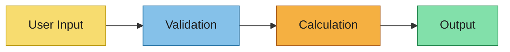
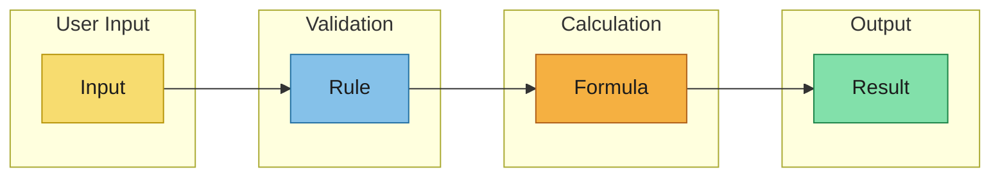

# Calculation Modeling

Convert event-storming outputs into explicit calculation flows.

Use this lane sequence for each scenario:
`User Input -> Validation -> Calculation -> Output`

## Scenario Overview
- Scenario:
- Business objective:
- Source references from `event-storming.md`:

## Swim Lanes

### User Input
- Input field/parameter:
- Data type and unit:
- Default value:
- Source (user-entered, derived, hardcoded):

### Validation
- Validation rule:
- Input(s) validated:
- Constraint (range, regulatory, business):
- Error/feedback on failure:

### Calculation
- Formula/engine:
- Input dependencies:
- Intermediate values computed:
- Precision/rounding rules:

### Output
- Output name:
- Data structure:
- Display format:
- Consumer (UI component, export, etc.):

## Mermaid Flow

## Swimlane Diagram

## Derivation Notes for Downstream Artifacts
- Specs inputs (user stories and acceptance criteria):
- Design inputs (calculation architecture, precision, formatting):
- Data schema inputs (types, formulas, validation rules):
