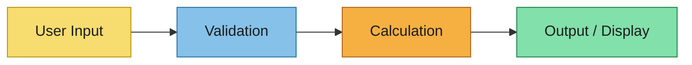

# Event Storming

Capture collaborative discovery outcomes for the calculation domain before formal specs.

## Scope and Goal
- Domain/problem area:
- Desired business outcome:
- In/out of scope:

## Actors
- Primary users:
- External data sources:
- Automated agents:

## Calculation Triggers
- Trigger:
  - What initiates this calculation:
  - Input signal (user action, data change):
  - Expected output:

## User Actions
- Action:
  - Actor (user/system):
  - Target domain/module:
  - Preconditions:
  - Expected result:

## Calculation Domains
- Domain/module:
  - Responsibilities:
  - Invariants (rules that must always hold):
  - Inputs consumed:
  - Outputs produced:

## Business Rules
- Rule name:
  - Triggering condition:
  - Constraint or formula applied:
  - Failure/violation handling:

## Calculation Flow Diagram (Mermaid)

## Hotspots and Open Questions
- Ambiguity:
- Risk:
- Decision needed:

## Handoff to Next Artifacts
Summarize how these findings should inform:
- `calculation-modeling.md`
- `specs/**/*.md`
- `design.md`
- `data-schema.md`
